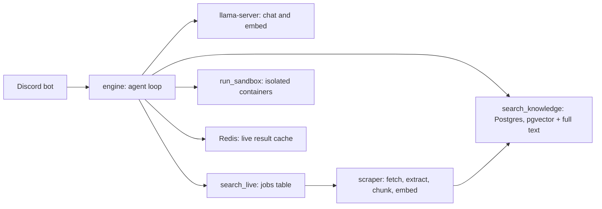

<p align="center">
  
</p>

<h3 align="center">SparkyAI</h3>

<p align="center">
  <a href="docs/ARCHITECTURE.md">Architecture</a> •
  <a href="deploy/README.md">Setup</a> •
  <a href="docs/ROADMAP.md">Roadmap</a> •
  <a href="docs/blog/sparkyai-v1.md">v1 write-up</a>
</p>

SparkyAI is an open-source assistant for Arizona State University students. It lives in Discord, answers from official ASU sources with links to them, and runs on open models on infrastructure we operate.

## Vision

A student should not have to dig through a dozen ASU sites to find a deadline, a club, an open seat or an office. Sparky does the digging: it searches, reads, and answers with sources, and it asks before it acts on anyone's behalf. Everything is open, from the agent loop to the scrapers to the data the model is later post-trained on.

## What it does

- Answers questions about courses, open seats, prerequisites, clubs, events, dining and library hours, shuttles, scholarships, jobs, news and sports.
- Searches a stored index of ASU pages and 17 live sources, sending several phrasings of a query at once and searching again until it has the answer.
- Reads login-gated pages such as Sun Devil Central clubs and events through one operator ASU session.
- Reads files a student attaches (PDF, Word, Excel, CSV, scanned pages) and works through long results in a sandboxed Linux container.
- Remembers what a student tells it in private conversations, and forgets on request.
- Holds any consequential action until the student approves it.

## How it works



- **engine** (Rust) runs the agent loop: prompt assembly, tool calls, policy, memory, tracing. Nothing is retrieved before the model asks; it calls the search tools itself. See [Agent loop](docs/ARCHITECTURE.md#agent-loop) and [Prompt assembly](docs/ARCHITECTURE.md#prompt-assembly).
- **scraper** (Python) keeps the index fresh on a schedule and answers live queries from a Postgres job queue, through Firecrawl, SearXNG, or a headless browser. See [Inside scraper](docs/ARCHITECTURE.md#inside-scraper) and [Live source queries](docs/ARCHITECTURE.md#live-source-queries).
- **discord** is a thin client of the engine's HTTP API that streams progress and renders answers. See [Discord surface](docs/ARCHITECTURE.md#discord-surface).
- Models are local: Qwen3 4B for chat and Qwen3 embeddings, served by llama-server.
- Every limit that matters under load is a setting in `sparky.toml`. See [Resource limits](docs/ARCHITECTURE.md#resource-limits).

## Run it

```
just bootstrap          # tools, .env, deps, infra, migrations
just scraper login      # the operator ASU session the scraper requires
just cli                # developer console for every unit
```

`just up` starts the full compose stack. Setup details are in [deploy/README.md](deploy/README.md), and [AGENTS.md](AGENTS.md) lists every recipe.

## Status

The rebuild is at v0.3. The original 2024 to 2025 prototype is preserved on [`archive/v1`](https://github.com/ashworks1706/SparkyAI/tree/archive/v1), with its write-up in [docs/blog/sparkyai-v1.md](docs/blog/sparkyai-v1.md).

## License

[MIT](LICENSE)
