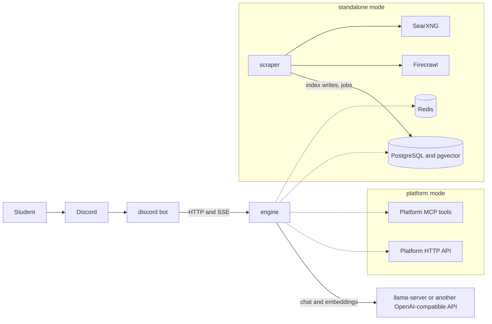

<p align="center">
  
</p>

<h3 align="center">SparkyAI</h3>

<p align="center">
  <a href="docs/ARCHITECTURE.md">Architecture</a> |
  <a href="docs/ROADMAP.md">Roadmap</a> |
  <a href="deploy/README.md">Setup</a>
</p>

SparkyAI is an assistant for Arizona State University students in Discord: a Rust agent engine, a Discord bot, a Python ingestion pipeline, and evals. It is an unofficial, open-source student project and is not affiliated with the university.

## Architecture

The engine runs its own agent loop and calls its tools itself. It runs in one of two modes, chosen by `platform.enabled` in `sparky.toml`:

- **Platform mode.** Conversations, memories, knowledge search, live ASU queries, Canvas, the Sun Devil Central clubs and events, and account linking come from the shared Platform, over its HTTP API and its MCP tools. The engine opens no database.
- **Standalone mode.** The engine has its own PostgreSQL with pgvector and Redis, and `apps/scraper` fetches and indexes ASU pages through Firecrawl and SearXNG. This mode builds with the cargo feature `standalone`, on by default.


```mermaid
flowchart LR
    U["Student"] --> DC["Discord"]
    DC --> BOT["discord bot"]
    BOT -->|"HTTP and SSE"| ENG["engine"]
    ENG -->|"chat and embeddings"| LLM["llama-server or another OpenAI-compatible API"]

    subgraph platform ["platform mode"]
        API["Platform HTTP API"]
        PMCP["Platform MCP tools"]
    end

    subgraph standalone ["standalone mode"]
        PG[("PostgreSQL and pgvector")]
        RD[("Redis")]
        SCR["scraper"]
        FC["Firecrawl"]
        SX["SearXNG"]
    end

    ENG -.-> API
    ENG -.-> PMCP
    ENG -.-> PG
    ENG -.-> RD
    SCR -->|"index writes, jobs"| PG
    SCR --> FC
    SCR --> SX
```

[docs/ARCHITECTURE.md](docs/ARCHITECTURE.md) has the details. Its Store modes section lists which parts each mode runs.

## Run it

Both modes need [just](https://just.systems), Rust, uv, Docker, a model server, and a Discord bot token and guild id in `.env`.

Platform mode:

```bash
just env          # creates .env from .env.example
# In .env set SPARKY_PLATFORM__ENABLED=true, SPARKY_PLATFORM__URL, SPARKY_PLATFORM__TOKEN
# and SPARKY_PLATFORM__MCP_URL. sparky.toml lists the scopes the token needs.
just model        # llama-server chat and embed on CUDA; just model-cpu without a GPU
just engine
just discord
```

Standalone mode:

```bash
just bootstrap    # .env, git hook, dependencies, postgres, redis, minio, migrations
just model        # or just model-cpu
just search       # SearXNG for web search
just crawl        # Firecrawl for pages that need JavaScript
just scraper serve
just engine
just discord
```

`just up` starts the whole standalone stack in compose. `just` alone lists every recipe, and [deploy/README.md](deploy/README.md) covers deployment.

## What is in the repo

| Path | Holds |
| --- | --- |
| `apps/engine/` | Rust: the agent loop, tools, policy, memory, tracing, and the HTTP API |
| `apps/discord/` | Rust: the Discord bot, an HTTP client of the engine |
| `apps/cli/` | Rust: a terminal console that runs and tails every unit |
| `apps/scraper/` | Python, standalone only: fetches, chunks and embeds ASU pages, and answers live queries |
| `apps/evals/` | Python: golden cases, scorers, and the baseline gate |
| `apps/web/` | Vite and React: the static site and admin UI |
| `deploy/` | Compose files, Dockerfiles, and model server config |
| `docs/` | `ARCHITECTURE.md` and `ROADMAP.md` |

## Evals

Evals send golden cases from `apps/evals/cases/` to a running engine and score its traces.

```bash
just eval run                  # every suite
just eval run --suite voice    # one suite
just eval baseline             # promote the last report to the baseline
just eval compare              # compare the last report with the baseline
```

The promoted baseline in `apps/evals/baseline.json`:

| Suite | Passed |
| --- | --- |
| tool_selection | 1 of 2 |
| tool_args | 1 of 1 |
| grounding | 2 of 2 |
| memory | 1 of 1 |
| permissions | 0 of 1 |
| clarification | 0 of 1 |
| refusal | 1 of 3 |
| latency | 2 of 2 |

## Data and etiquette

The scraper reads the same public pages a browser does. It identifies itself as `SparkyAI/2.0 (+https://github.com/ashworks1706/SparkyAI)`, obeys robots.txt, waits between requests to one site, and cites the original page. Pages behind a login stay off unless `auth.enabled` is set. To have a site excluded, open an issue.

## Docs

- [docs/ARCHITECTURE.md](docs/ARCHITECTURE.md): crate boundaries, traits, store modes, and invariants
- [docs/ROADMAP.md](docs/ROADMAP.md): what is built next, and what is out of scope
- [AGENTS.md](AGENTS.md): commands and rules for contributors and coding agents

The 2024 to 2025 prototype is on [`archive/v1`](https://github.com/ashworks1706/SparkyAI/tree/archive/v1), with a write-up in [docs/blog/sparkyai-v1.md](docs/blog/sparkyai-v1.md).

## License

[MIT](LICENSE)
