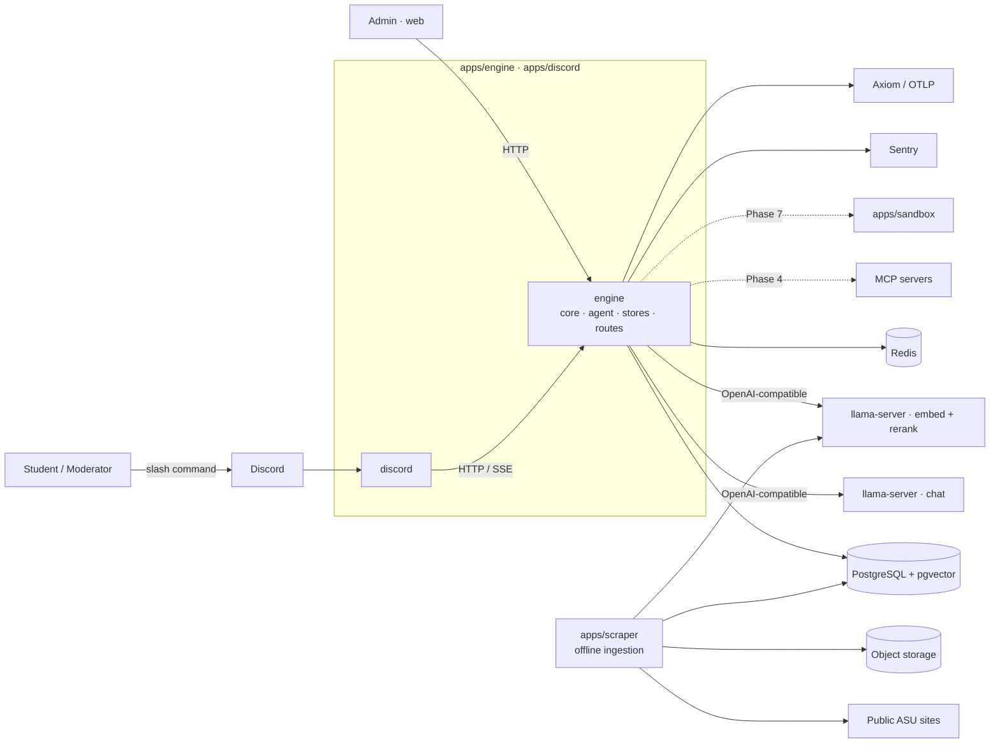

# Architecture

SparkyAI is a Discord copilot for the AI Society at ASU. It answers questions from public ASU sources, keeps conversation and user memory, and performs moderator actions in Discord. Later phases add MCP tools and a sandboxed browser for authenticated tasks.

This document is the target shape. Order of work is in [ROADMAP.md](ROADMAP.md); decisions are in [decisions/](decisions/).

## Stack

| Layer | Choice | Where |
|---|---|---|
| Engine, Discord bot | Rust 2024 — tokio, axum, serenity, serde, thiserror, figment | `apps/engine`, `apps/discord` |
| Model, embed clients | Rig (`rig-core`) OpenAI-compatible client → llama-server; never `rig::Agent` | `apps/engine/src/agent/model/rig_openai.rs` |
| Rerank client | Direct HTTP to llama-server `/v1/rerank` (no Rig provider) | `apps/engine/src/agent/model/rerank.rs` |
| MCP | `rmcp` (official SDK) | `apps/engine` (Phase 4) |
| Scraper | Python 3.12 — psycopg, boto3, httpx | `apps/scraper` |
| Fetching | httpx + BeautifulSoup; Playwright where JS is required | `apps/scraper` |
| Sandboxed browser | Python + Playwright, FastAPI task protocol | `apps/sandbox` (Phase 7) |
| Web | Vite + React + TypeScript + shadcn | `apps/web` |
| Post-training | TRL + PEFT (+ Unsloth), W&B, HF Hub | `apps/training` |
| Evals | Inspect AI, BFCL, lm-eval | `apps/training/evals` |
| Chat model | Qwen3 GGUF on `llama-server` (OpenAI-compatible HTTP) | `deploy/inference` |
| Embeddings, reranker | Qwen3-Embedding-0.6B (1024-dim), Qwen3-Reranker-0.6B on `llama-server` | `deploy/inference` |
| Database | PostgreSQL 17 — source of truth | `apps/engine` reads, `apps/scraper` writes |
| Vector store | pgvector, in the same PostgreSQL (rebuildable) | same database |
| Cache, queue | Redis 7 | `apps/engine` |
| Object storage | S3-compatible (MinIO locally) — snapshots, artifacts | `apps/scraper` |
| Observability | Sentry (errors), OpenTelemetry → Phoenix locally / any OTLP collector deployed (traces, OpenInference attributes), JSON logs | every app; `deploy/compose.yml` `phoenix` |
| Config | `SPARKY_<SECTION>__<KEY>` env vars; secrets never logged | `config.rs`, `settings.py`, `.env.example` |
| Build, gate | `just` recipes; the same ones run in the pre-commit hook and CI | `justfile`, `.githooks`, `.github/workflows` |
| Deploy | Docker Compose (dev builds locally, prod pulls GHCR); `llama-server` on a GPU host | `deploy/` |

## Rules

- Open models only, served by `llama-server` behind an OpenAI-compatible HTTP API.
- Facts come from retrieval or live observation, never from model weights.
- Public sites are ingested offline. The request path never fetches a web page.
- The engine and the scraper both open database connections; nothing else does. They share the schema in `apps/scraper/migrations`, not code.
- Every request carries its own `RequestContext`. No global mutable state.
- Every replaceable dependency is a trait in `engine/src/agent/harness` with a mock for tests.
- The harness owns the loop, policy, context assembly, memory, and tracing. Provider JSON never leaves `agent/model`.
- Model output is never written back as retrieval evidence.
- Anything that creates, changes, submits, posts, books, or deletes requires confirmation immediately before the action.
- Credentials, cookies, and authenticated page content never enter retrieval indexes, memory, or traces.

## Layout

```
apps/
  engine/         Rust bin. The agent, its HTTP surface, and the store adapters.
    src/core/       config · telemetry · types (every struct and enum) · traits (every interface) · tests. Imports nothing else.
    src/agent/      harness (loop, assembly, policy, sinks — impls only) · model (Rig → llama-server chat/embed; HTTP rerank) · tools
    src/stores/     postgres: Retriever, ConversationStore, MemoryStore
    src/routes/     chat, health, admin
    src/{telemetry,wiring}.rs
  discord/        Rust bin. serenity bot; HTTP client of engine. Never links it. core/{config,telemetry,types,tests}.
  scraper/        Python. Offline ingestion: fetch → snapshot → extract → chunk → embed → index.
    core/{settings,types,tests} · sources · store · migrations/ (the schema)
  training/       Python. datasets, post-training, eval runners; evals/cases holds the shared eval data
  sandbox/        Python + Playwright worker (Phase 7); HTTP task protocol; one context per user session
  web/            Vite + React frontend and admin UI
deploy/           compose (dev + prod), one Dockerfile per image, inference/ (model serving config)
docs/             ROADMAP.md, this file, decisions/
```

Each Python app directory is itself the importable package — `apps/scraper` is `scraper` — with no `src/` layer and no repeated directory name. `pyproject.toml` maps the package to `.` and lists its subpackages, so a new subpackage must be added there.

Every app has a `core/`: config or settings, telemetry, every type and trait, and tests. Domain modules import from it and hold only behaviour; it imports nothing from them.

Everything that runs is under `apps/`. Language is never a folder. ASU domain (library, events, …) is never a folder either — it is a row in `sources` or an entry in a registry.

Services talk only at these edges: `discord → engine`, `engine → PostgreSQL / llama-server / MCP / sandbox`, `scraper → PostgreSQL / llama-server embed`. The scraper never serves a request; it and the engine meet only in the database.

## System context



Solid arrows exist or are in the current phase; dashed are later phases. Only the scraper touches the web. The engine and the scraper meet only in PostgreSQL.

## Inside `engine`

`core` imports nothing else in the crate. `agent::harness`, `agent::model`, `agent::tools`, and `stores` import only `core`, never each other. `routes` and `wiring` compose them. Every struct and enum is defined in `core/types` and every trait in `core/traits`; the other modules contain only `impl` blocks and functions. Tests live in `core/tests`. This is a convention checked in review. Between apps it is enforced: `scripts/check-deps.sh` fails if `discord` and `engine` ever depend on each other, and `[workspace.lints]` applies the same code rules to both.

## Inside `scraper`

`store/` is the only place it opens a connection. `migrations/` is the schema contract with `engine`: the scraper writes `chunks`, the engine reads them, and `embed.py` must use the model and dimension the engine queries with. Changing the embedding model means re-embedding every chunk.

## Types

```rust
pub struct UserEvent {
    pub request_id: RequestId,
    pub source: EventSource,        // Discord, Http
    pub tenant_id: TenantId,        // the Discord guild; keeps data scoped
    pub user_id: UserId,
    pub channel_id: ChannelId,
    pub content: MessageContent,
    pub received_at: DateTime<Utc>,
}

pub struct RequestContext {
    pub request_id: RequestId,
    pub tenant_id: TenantId,
    pub user: UserIdentity,
    pub roles: Vec<Role>,
    pub conversation_id: ConversationId,
    pub deadline: Instant,
    pub cancel: CancellationToken,
    pub trace: TraceContext,
}

pub struct Evidence {
    pub source_id: SourceId,
    pub document_id: DocumentId,
    pub title: String,
    pub content: String,
    pub url: Option<Url>,
    pub fetched_at: DateTime<Utc>,
    pub score: f32,
}
```

Citations are built from `Evidence`, not parsed out of generated text.

## Traits

All in `engine/src/core/traits`, implemented in `agent::harness`, `agent::model`, `agent::tools`, and `stores`. Inputs and outputs are owned Sparky types from `core/types`.

```rust
#[async_trait]
pub trait ModelProvider {
    async fn generate(&self, ctx: &RequestContext, req: ModelRequest) -> Result<ModelStream, ModelError>;
}

#[async_trait]
pub trait Tool {
    fn definition(&self) -> ToolDefinition;   // name, description, JSON schema, RiskClass
    async fn call(&self, ctx: &RequestContext, args: Value) -> Result<ToolOutput, ToolError>;
}

#[async_trait]
pub trait Retriever {
    async fn retrieve(&self, ctx: &RequestContext, q: RetrievalQuery) -> Result<Vec<Evidence>, RetrievalError>;
}

#[async_trait]
pub trait ConversationStore {
    async fn load(&self, ctx: &RequestContext) -> Result<Vec<Message>, StoreError>;
    async fn append(&self, ctx: &RequestContext, turn: Turn) -> Result<(), StoreError>;
}

#[async_trait]
pub trait MemoryStore {
    async fn recall(&self, ctx: &RequestContext, q: MemoryQuery) -> Result<Vec<Memory>, MemoryError>;
    async fn write(&self, ctx: &RequestContext, m: MemoryCandidate) -> Result<Option<MemoryId>, MemoryError>;
    async fn forget(&self, ctx: &RequestContext, id: MemoryId) -> Result<(), MemoryError>;
}

#[async_trait]
pub trait Policy {
    async fn authorize(&self, ctx: &RequestContext, a: ProposedAction) -> Result<Decision, PolicyError>;
    // Decision: Allow | Deny(reason) | Confirm(ConfirmationRequest)
}

pub trait TraceSink {
    fn emit(&self, ctx: &RequestContext, e: TraceEvent);
}

#[async_trait]
pub trait Sandbox {   // Phase 7
    async fn run(&self, ctx: &RequestContext, t: BrowserTask) -> Result<BrowserResult, SandboxError>;
}
```

## Request lifecycle

1. `discord` receives the slash command and POSTs it to `engine` with the Discord identity and roles. Web and admin clients hit the same endpoint.
2. `engine` normalizes it into `UserEvent`, resolves roles and permissions → `RequestContext`.
3. Load conversation, recall memory, and retrieve evidence from PostgreSQL if the query needs it.
4. Assemble context within a token budget, in fixed order: system instructions (versioned) → role/permissions → current request → relevant turns → memory → evidence → tool definitions. Tool output and evidence are truncated before old history is.
5. Call the model; validate structured output. One correction attempt on invalid output, then stop.
6. For each proposed tool call: `Policy::authorize` → Allow / Deny / Confirm.
7. Execute allowed calls with timeout and cancellation. Parallel when independent.
8. Loop until final answer, error, cancel, deadline, or step limit.
9. Persist turn, memory candidates that pass the write policy, and trace.
10. Reply with citations.

## Tool risk classes

| Class | Examples | Behavior |
|---|---|---|
| `ReadPublic` | search indexed pages, library hours | run |
| `ReadAuthenticated` | read a page in the user's own browser session | run after session authorization |
| `PrepareWrite` | draft an announcement, fill a form without submitting | run |
| `ExternalWrite` | post, create ticket, book, submit | confirm immediately before |
| `Destructive` | delete, cancel | confirm immediately before |
| `Forbidden` | another user's session, bypassing policy | deny |

A confirmation is bound to one exact action payload, is single-use and short-lived, states what happens / where / with what data / whether reversible, and is recorded in the trace. If the payload changes, confirm again. External writes are never auto-retried without an idempotency key.

## Knowledge

Ingestion runs offline in `apps/scraper`: fetch → content hash (skip if unchanged) → raw snapshot to object storage → extract → chunk → embed → index (Postgres `chunks` + `source_versions`). Each document records canonical source, fetch time, content hash, parser/chunker/embedding versions, and its previous version on change.

Retrieval happens inside the engine: dense top-k (pgvector, filtered by tenant and category) + BM25 top-k (Postgres FTS) → RRF fusion → rerank (llama-server) → `Evidence`. If nothing is found or the source is stale, the answer says so.

## Memory

| Kind | Content |
|---|---|
| Working | current request; not persisted |
| Conversation | turns and tool results |
| Episodic | a useful event from a prior interaction |
| Semantic | a stable inferred fact |
| Profile | approved preferences, interests, goals |
| Task | state to continue a multi-step job |

A candidate is written only if it is useful later, stable, belongs to this user, permitted by its sensitivity class, not a duplicate, and has an expiry. Recall filters by `tenant_id` and `user_id` before ranking; the interface cannot express a cross-user query. Users can view and delete their memory (Phase 4). Conflicting memories keep provenance and timestamps; newer and higher-confidence wins at assembly time, nothing is silently rewritten.

## Storage

| Data | Store |
|---|---|
| users, roles, conversations, messages, memories, source metadata and versions, jobs, confirmations | PostgreSQL (source of truth) |
| chunk embeddings with `source_id`, `version`, `category`, `fetched_at` | pgvector, same PostgreSQL (rebuildable) |
| rate limits, queue, short-lived cache | Redis |
| raw snapshots, model artifacts | object storage |
| browser session secrets | encrypted, separate namespace |
| traces | JSONL locally (replay source); OpenTelemetry to Phoenix locally, any OTLP collector deployed |

Durable job state lives in Postgres, so a Redis restart loses nothing. Schema is `apps/scraper/migrations`.

## Background jobs

Discord handlers never block on long work. Ingestion, embedding, browser tasks, reminders, evals, and trace processing run as jobs with id, owner, type, status, input ref, attempts, deadline, cancel state, result ref, and error category.

## Failure behavior

| Failure | Response |
|---|---|
| model unavailable | retry within deadline, then clear error |
| invalid tool call from model | one correction, then stop |
| tool timeout | cancel, trace, report |
| retrieval empty | say so; do not guess |
| sources conflict | show both with dates |
| confirmation denied or expired | do nothing |
| write result unclear | do not retry; inspect final state |
| Postgres unavailable | reject stateful requests rather than run without identity or policy |
| trace sink unavailable | continue only with a bounded local fallback |

## Tracing

One trace per request covering every model call, retrieval, memory access, tool call, policy decision, confirmation, and error. Records ids, model/prompt/template versions, evidence and memory ids, validated tool args, timings, tokens, final status. Never passwords, cookies, auth codes, tokens, or raw sensitive form values. Any request can be replayed from its trace against a chosen model, prompt, tool set, and retrieval snapshot; that is the eval harness.

## Sandboxed browser (Phase 7)

Separate worker (`apps/sandbox`), never inside the engine process. One isolated browser context per user session; the user completes login and MFA themselves; SparkyAI never asks for or stores a password. Allowlisted domains, blocked or quarantined downloads, size-limited structured observations, redacted action logs, session expiry and cleanup. CAPTCHA, MFA failure, expired session, or an unexpected page stops the task. Authenticated page content is never indexed or memorized. Requires explicit authorization before work begins (see roadmap out-of-scope).

## Deployment

Three images: `sparkyai-rust` (`engine` and `discord`; entrypoint selects), `sparkyai-scraper`, `sparkyai-sandbox` (Phase 7, compose profile `sandbox`). CD rebuilds only the images whose inputs changed. Datastores run beside them in Compose; `llama-server` runs from `deploy/inference`. Split further only on a measured need: independent scaling, failure isolation, hardware, or a security boundary. Details: `deploy/README.md`.

## Open decisions

Chat model size and quantization · parallel slots per llama-server under load · queue implementation · memory retention periods · moderator access to user conversations and traces · MCP servers in-process vs child process vs remote · app server host.

Record each as a short note under `docs/decisions/` when made.
