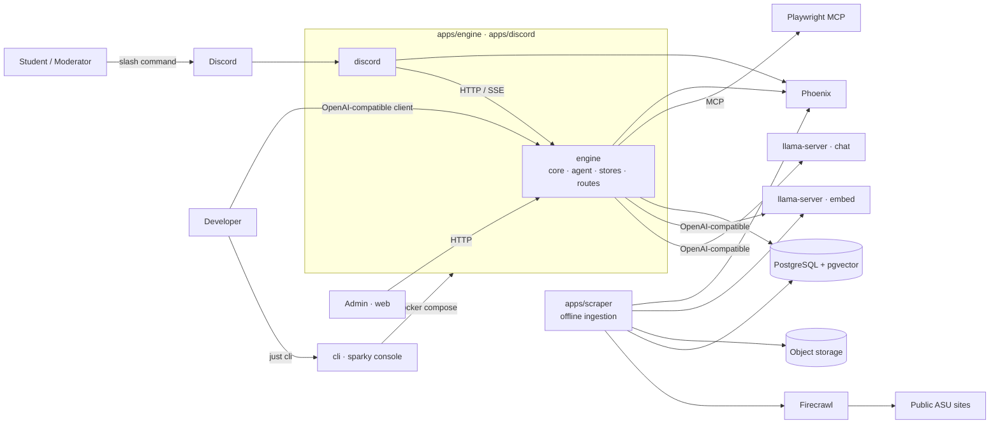
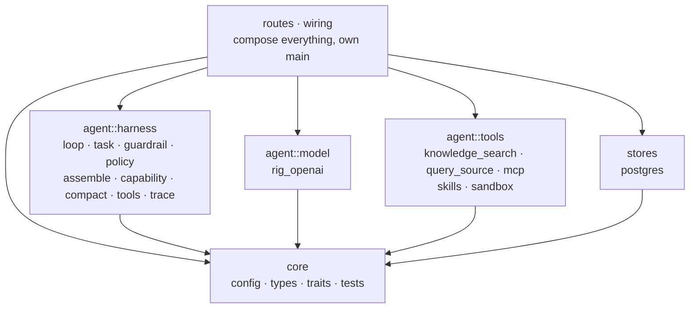
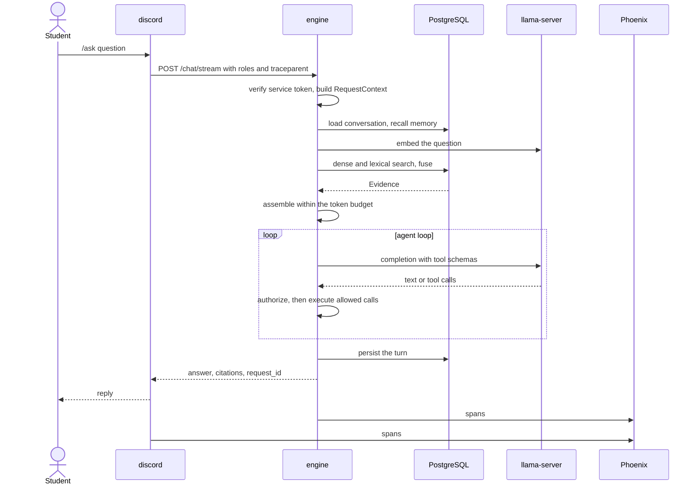
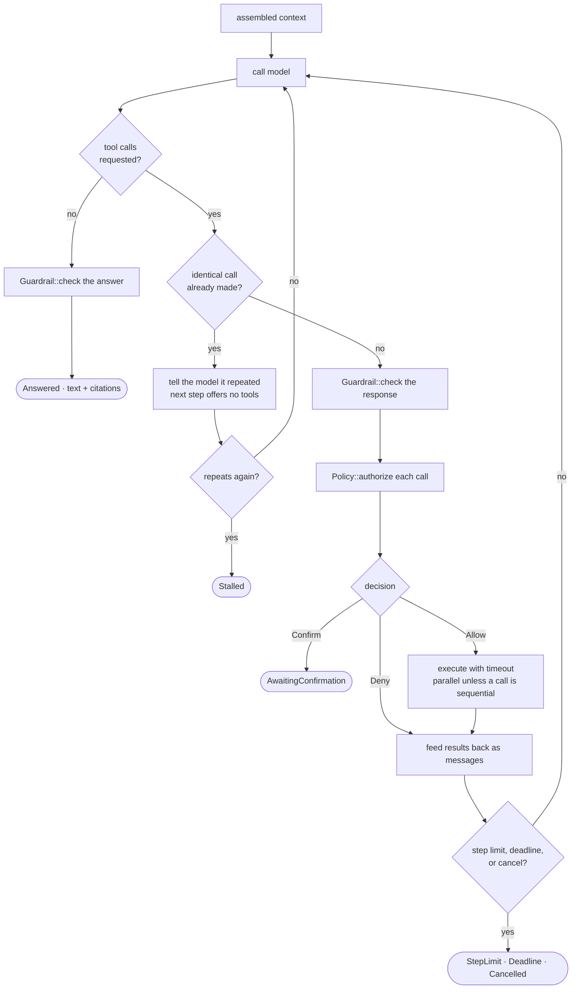
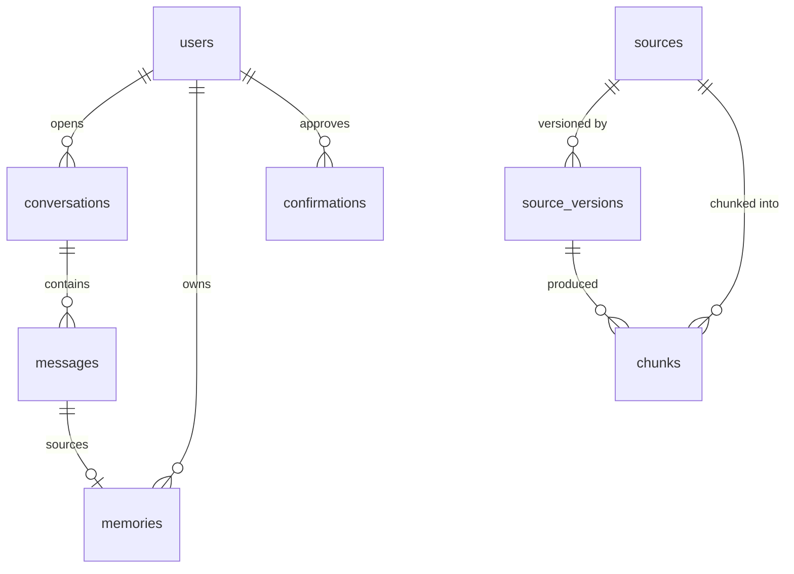
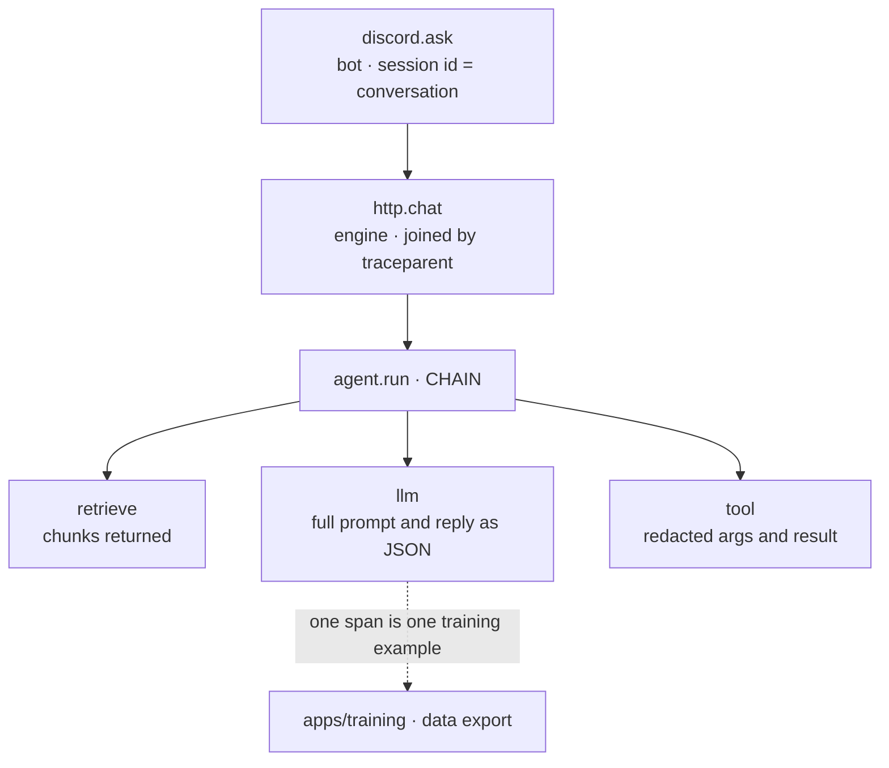
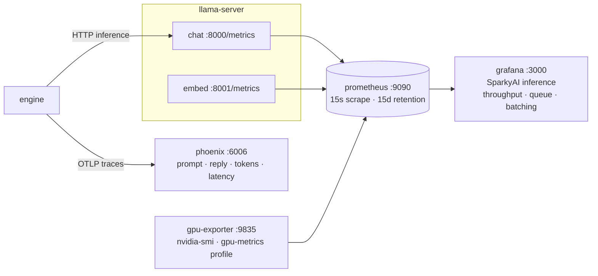

# Architecture

SparkyAI is a Discord copilot for the AI Society at ASU. It answers questions from public ASU sources, keeps conversation and user memory, and performs moderator actions in Discord. Later phases add authenticated browser tasks through the same Playwright MCP server.

This document is the target shape. Order of work is in [ROADMAP.md](ROADMAP.md); decisions are in [decisions/](decisions/).

## Stack

| Layer | Choice | Where |
|---|---|---|
| Engine, Discord bot | tokio, axum, serenity, serde, thiserror, figment | `apps/engine`, `apps/discord` |
| Model and embed clients | Rig (`rig-core`) OpenAI-compatible client. | `apps/engine/src/agent/model/rig_openai.rs` |
| MCP | `rmcp` (official SDK); Playwright MCP | `apps/engine/src/agent/tools/mcp.rs` |
| Scraper | psycopg, boto3, httpx | `apps/scraper` |
| Fetch + extract | Firecrawl, self-hosted; httpx + BeautifulSoup | `deploy/compose.yml` profile `crawl` |
| Browser tools | Playwright MCP over Streamable HTTP | `apps/engine/src/agent/tools/mcp.rs`, compose profile `browser` |
| Web | Vite + React + TypeScript + shadcn | `apps/web` |
| Post-training | Unsloth QLoRA + TRL, TensorBoard, GGUF | `apps/training/posttrain` |
| Evals | Golden cases against `/chat`, deterministic baseline gate | `apps/training/evals` |
| Chat model | Qwen3 GGUF on `llama-server` (OpenAI-compatible HTTP) | `deploy/inference` |
| Embeddings | Qwen3-Embedding-0.6B (1024-dim) on `llama-server` | `deploy/inference` |
| Database | PostgreSQL 17 | `apps/engine` reads, `apps/scraper` writes |
| Vector store | pgvector | same database |
| Cache, queue | Redis 7 | `apps/engine` |
| Object storage | S3-compatible (MinIO locally) | `apps/scraper` |
| Observability | OpenTelemetry → Phoenix; logs under `.sparky/` | every app; `deploy/compose.yml` `phoenix` |
| Config | `sparky.toml` (committed), then `SPARKY_*` env vars from `.env`, which win | `sparky.toml`, `config.rs`, `settings.py`, `.env.example` |
| Build, gate | `just` recipes; pre-commit hook and CI | `justfile`, `.githooks`, `.github/workflows` |
| Deploy | Docker Compose (prod pulls GHCR); `llama-server` on a GPU host | `deploy/` |

## Rules

- Open models only, served by `llama-server` behind an OpenAI-compatible HTTP API.
- Facts come from retrieval or live observation, never from model weights.
- Public sites are ingested offline through Firecrawl. The request path never fetches a page as retrieval evidence; browser tools act under `Policy` and never write to the index.
- The engine and the scraper both open database connections; nothing else does. They share the schema in `apps/scraper/migrations`, not code.
- Every request carries its own `RequestContext`. No global mutable state.
- Every replaceable dependency is a trait in `engine/src/core/traits` with a test double in `core/tests/support`.
- The harness owns the loop, policy, context assembly, memory, and tracing. Provider JSON never leaves `agent/model`.
- Model output is never written back as retrieval evidence.
- Anything that creates, changes, submits, posts, books, or deletes requires confirmation immediately before the action.
- Credentials, cookies, and authenticated page content never enter retrieval indexes, memory, or traces.

## Layout

```
apps/
  engine/         Rust bin. The agent, its HTTP surface, and the store adapters.
    src/core/       config · telemetry · types (data: messages, config, errors, wire shapes) · traits (interfaces) · tests. Imports nothing else.
    src/agent/      harness (Agent, ToolSet, RiskPolicy, sinks, assembly) · model (Rig → llama-server chat and embed) · tools
    src/stores/     postgres: Retriever, ConversationStore, MemoryStore
    src/routes/     chat (JSON and SSE), openai (/v1), health
    src/wiring.rs
  discord/        Rust bin. serenity bot; HTTP client of engine. Never links it. core/{config,telemetry,types,tests}.
  cli/            Rust bin `sparky`. Developer console: runs just recipes and compose services and tails them. core/{config,types,tests}.
  scraper/        Python. Offline ingestion: fetch → snapshot → extract → chunk → embed → index.
    core/{settings,types,tests} · sources · store · migrations/ (the schema)
  training/       Python. datasets from Phoenix llm spans, evals with a baseline gate, SFT → GGUF; evals/cases holds the golden set
  web/            Vite + React frontend and admin UI
deploy/           compose (dev + prod), one Dockerfile per image, inference/ (model serving config)
docs/             ROADMAP.md, this file, decisions/
.sparky/          ignored local state: traces, logs, training data, reports, and outputs
```

Each Python app directory is itself the importable package — `apps/scraper` is `scraper` — with no `src/` layer and no repeated directory name. `pyproject.toml` maps the package to `.` and lists its subpackages, so a new subpackage must be added there.

Every app has a `core/`: config or settings, telemetry, data types, interfaces, and tests. Domain modules import from it; it imports nothing from them.

Everything that runs is under `apps/`. Language is never a folder. ASU domain (library, events, …) is never a folder either — it is a row in `sources` or an entry in a registry.

Services talk only at these edges: `discord → engine`, `engine → PostgreSQL / llama-server / MCP`, `scraper → PostgreSQL / llama-server embed`. The scraper never serves a request; it and the engine meet only in the database.

## System context



Only the scraper touches the web. The engine and the scraper meet only in PostgreSQL. The console starts and stops the other units. The engine serves `/chat` and `/chat/stream` for the bot and an OpenAI-compatible `/v1/chat/completions` for off-the-shelf clients; all three run the same loop.

## Inside `engine`



`core` imports nothing else in the crate. `agent::harness`, `agent::model`, `agent::tools`, and `stores` import only `core`; `routes` and `wiring` compose them. Data lives in `core/types`, interfaces in `core/traits`, and stateful objects beside their implementations. `scripts/check-deps.sh` enforces separation between the Rust apps.

## Inside `scraper`

`store/` is the only place it opens a connection. `migrations/` is the schema contract with `engine`: the scraper writes `chunks`, the engine reads them, and `embed.py` must use the model and dimension the engine queries with. Changing the embedding model means re-embedding every chunk.

## Types

```rust
pub struct RequestContext {
    pub request_id: Uuid,
    pub tenant_id: String,
    pub user_id: String,
    pub roles: Vec<String>,
    pub conversation_id: Uuid,
    pub deadline: Instant,
    pub cancel: CancellationToken,
    /// Live progress goes here while a caller is watching; `None` for a plain request.
    pub progress: Option<UnboundedSender<Progress>>,
}

pub struct Evidence {
    pub source_id: Uuid,
    pub chunk_id: Uuid,
    pub title: String,
    pub content: String,
    pub url: Option<String>,
    pub fetched_at: DateTime<Utc>,
    pub score: f32,
}
```

Citations are built from `Evidence`, not parsed out of generated text.

## Traits

All in `engine/src/core/traits`, implemented in `agent::harness`, `agent::model`, `agent::tools`, and `stores`. Inputs and outputs are owned Sparky types from `core/types`.

```rust
#[async_trait]
pub trait ModelProvider {
    async fn generate(&self, ctx: &RequestContext, req: ModelRequest) -> Result<ModelResponse, ModelError>;
}

#[async_trait]
pub trait Tool {
    fn definition(&self) -> ToolDefinition;   // name, description, JSON schema, RiskClass
    async fn call(&self, ctx: &RequestContext, args: Value) -> Result<ToolOutput, ToolError>;
}

#[async_trait]
pub trait Retriever {
    async fn retrieve(&self, ctx: &RequestContext, q: &RetrievalQuery) -> Result<Vec<Evidence>, RetrievalError>;
}

#[async_trait]
pub trait ConversationStore {
    async fn ensure(&self, ctx: &RequestContext, channel_id: &str) -> Result<(), StoreError>;
    async fn load(&self, ctx: &RequestContext, limit: usize) -> Result<Vec<Message>, StoreError>;
    async fn append(&self, ctx: &RequestContext, turns: &[Message]) -> Result<(), StoreError>;
}

#[async_trait]
pub trait MemoryStore {
    async fn recall(&self, ctx: &RequestContext, q: &MemoryQuery) -> Result<Vec<Memory>, StoreError>;
    // write and forget arrive with Phase 5, when the agent starts producing memories
}

#[async_trait]
pub trait Embedder {
    async fn embed(&self, texts: &[String]) -> Result<Vec<Vec<f32>>, RetrievalError>;
    fn dim(&self) -> usize;
}

#[async_trait]
pub trait Policy {
    async fn authorize(&self, ctx: &RequestContext, action: &ProposedAction) -> Decision;
    // Decision: Allow | Deny(reason) | Confirm(ConfirmationRequest)
}

pub trait TraceSink {
    fn emit(&self, ctx: &RequestContext, e: TraceEvent);
}
```

## Request lifecycle



1. `discord` receives the slash command and POSTs it to `engine` with the Discord identity, roles, and native permissions. Web and admin clients hit the same endpoints.
2. `engine` checks the service token, then turns the request and its asserted roles into a `RequestContext`.
3. Load conversation, recall memory, and retrieve evidence from PostgreSQL if the query needs it.
4. Assemble context within a token budget, in fixed order: system instructions (versioned) → role/permissions → memory → evidence → relevant turns → current request, with tool definitions alongside. Tool schemas are charged to the budget first; evidence and history are trimmed to what remains. MCP schemas are compacted and, by default, show only required properties.
5. Run the agent loop below.
6. Persist turn, memory candidates that pass the write policy, and trace.
7. Reply with citations built from `Evidence`.

## Agent loop



The loop owns every stopping condition. Structured output gets one correction attempt. Independent calls run in parallel; a stateful tool makes the step sequential. Identical calls are not run twice.

Every model response passes the guardrail, on the execution branch and on the answer branch alike. The guardrail is the outer gate and `Policy` is what it consults for a proposed action: `Policy` classifies a typed action by risk, the guardrail decides whether a response may proceed at all. Neither replaces the other.

## Prompted sub-agents

The harness runs more than one prompt. The loop is one of them; compaction and profile extraction are others, each with its own instructions and its own model call, and none of them but the loop may call a tool.

| Agent | When | Reads | Writes |
|---|---|---|---|
| Sparky | every request | retrieval, memory, history, capabilities | the turn |
| Chat | the context window fills | the turns being replaced | one compacted turn |
| Graph | after a turn is appended, when the classifier finds something | the turn | the profile graph |

`agent::harness::task` is what they share: a prompt, one model call, no tools, a typed result. The loop is not built on it, because the loop is the thing with tools and stopping conditions.

## Capabilities

What the model may do is one list, not several. `agent::harness::capability` renders the `<capabilities>` section of the prompt and each entry names its kind.

| Kind | Executed by | Risk |
|---|---|---|
| `tool` | a built-in `Tool` | declared per tool |
| `mcp` | a remote MCP server | derived from the tool name |
| `skill` | fetched by `get_skill`, then followed | the steps it names |
| `sandbox` | a command in an isolated environment | its own class |

A sandbox call naming a session runs in a container that outlives it, so what an earlier command wrote under /tmp is still there. Session containers are named from the tenant and the user, so naming another caller's session reaches a container of one's own instead of theirs.

A skill is a saved procedure, not code the model wrote: parameters, an ordered list of steps, and the domain it applies to. `get_skill` fetches one; the model follows it with the capabilities it already has. Skills are reviewed before they are offered, so a skill is never promoted from a trace without a person in the loop.

## Compaction

History is trimmed to its budget by dropping the oldest turns. When the window fills, the Chat Agent replaces the turns it would have dropped with one compacted turn instead.

A compacted turn is model output. It is stored with its own role so a replayed conversation can tell it from what the user and the assistant actually said, it is never retrieval evidence, and the turns it replaced stay in `messages`. Compaction changes what the next prompt carries, not what happened.

## Profile graph

Flat memory rows answer what a user said. They do not answer how two facts relate. The profile graph holds entities, the relations between them, and an embedding per node, so recall can start from a relation rather than from similarity alone.

Extraction never runs in the request path. After a turn is appended, the loop hands it to the profile writer and returns, and the writer carries its own context and deadline.

The gate is rules, not a model call. It runs on every turn, so a greeting must cost nothing: `FactDetector` looks for a first-person marker next to a stative cue and rejects questions. Only a turn that passes reaches the Graph Agent, which is the prompted sub-agent that extracts. Generic embeddings are not the gate because they encode topic and style rather than whether a sentence is worth keeping, and they place `I like this` and `I do not like this` close together; a trained head could replace the rules through the same trait.

A new fact is reconciled against what is already recorded for the same subject and relation before it is written. The reconciler is a prompted sub-agent: it sees the new statement and the ones it might replace, and names the ones the new statement makes false. Two statements that can both be true are both kept, which is the case a fact extractor that strips scope gets wrong. An answer that cannot be read withdraws nothing, since keeping a stale fact is recoverable and removing a true one is not.

Every rule in Memory still holds: recall filters by `tenant_id` and `user_id` before ranking, sensitivity gates what may be written, and users can view and delete. `POST /profile/forget` removes one label or everything a user carries; relations cascade from the node they run through.

## Tool risk classes

| Class | Examples | Behavior |
|---|---|---|
| `ReadPublic` | search indexed pages, library hours | run |
| `ReadAuthenticated` | read a page in the user's own browser session | deny unless `policy.allow_authenticated_reads` |
| `PrepareWrite` | draft an announcement, fill a form without submitting | run |
| `ExternalWrite` | post, create ticket, book, submit | require a `policy.write_roles` role, then confirm immediately before |
| `Destructive` | delete, cancel | require a `policy.write_roles` role, then confirm immediately before |
| `Forbidden` | another user's session, bypassing policy | deny |

The classes are ordered as listed. `policy.write_roles` gates `ExternalWrite` and above; `policy.confirm_from` names the lowest class held for the caller's approval, so a deployment can hold drafts too while a new tool is being trusted. `Forbidden` is denied whatever the settings say. Defaults are `["MANAGE_GUILD"]`, `external_write`, and authenticated reads off.

A confirmation is bound to one exact action payload, is single-use and short-lived, states what happens / where / with what data / whether reversible, and is recorded in the trace. If the payload changes, confirm again. External writes are never auto-retried without an idempotency key.

## Hierarchical index

Ingestion clusters the chunks of one source, writes a model summary of each cluster as a new row, embeds it, and recurses, so the index holds both the detail of a page and the shape of it. A summary row lives in `chunks` beside the leaves, distinguished by `level` and pointing at what it covers through `parent_id`.

Retrieval searches every level at once rather than walking down from the root, which is what the RAPTOR paper finds works better: a query lands on whatever granularity answers it. A summary and the chunks it covers can both score well and say the same thing twice, so after fusion a row whose summary already scored higher is dropped. A chunk that outranks its own summary keeps both, since the chunk is the answer and the summary is the context around it.

The tree is off by default. It costs a model call per cluster per level, and a flat index answers a short page.

## Knowledge

Ingestion runs offline in `apps/scraper`. Each document records canonical source, fetch time, content hash, parser/chunker/embedding versions, and its previous version on change.


Retrieval happens inside the engine, over the same rows.


Both queries filter by tenant and category. Reciprocal rank fusion combines dense and lexical results without comparing their incompatible raw scores. A reranker is deferred until evals justify it.

## Memory

| Kind | Content |
|---|---|
| Working | current request; not persisted |
| Conversation | turns and tool results |
| Episodic | a useful event from a prior interaction |
| Semantic | a stable inferred fact |
| Profile | approved preferences, interests, goals |
| Task | state to continue a multi-step job |

A candidate is written only if it is useful later, stable, belongs to this user, permitted by its sensitivity class, not a duplicate, and has an expiry. Recall filters by `tenant_id` and `user_id` before ranking; the interface cannot express a cross-user query. Users can view and delete their memory (Phase 5). Conflicting memories keep provenance and timestamps; newer and higher-confidence wins at assembly time, nothing is silently rewritten.

## Storage

| Data | Store |
|---|---|
| users, roles, conversations, messages, memories, source metadata and versions, jobs, confirmations | PostgreSQL (source of truth) |
| chunk embeddings with `source_id`, `version`, `category`, `fetched_at` | pgvector, same PostgreSQL (rebuildable) |
| raw snapshots, model artifacts | object storage |
| browser session secrets | encrypted, separate namespace |
| local traces, console logs, training outputs | `.sparky/` (ignored) |



Each `chunks` row contains a `vector(1024)` embedding and a generated `tsvector`. HNSW, GIN, and tenant/category/fetch-time indexes serve retrieval. Redis is provisioned but unused until multiple engine replicas require shared ephemeral state.

## Background jobs

Discord handlers never block on long work. Ingestion, embedding, browser tasks, reminders, evals, and trace processing run as jobs with id, owner, type, status, input ref, attempts, deadline, cancel state, result ref, and error category.

## Failure behavior

| Failure | Response |
|---|---|
| model unavailable | retry within deadline, then clear error |
| invalid tool call from model | one correction, then stop |
| model repeats an identical tool call | refuse the repeat, next step offers no tools; stop as `Stalled` if it repeats again |
| prompt would exceed the context | tool schemas count against the budget; evidence and history are trimmed first |
| tool timeout | cancel, trace, report |
| retrieval empty | say so; do not guess |
| sources conflict | show both with dates |
| confirmation denied or expired | do nothing |
| write result unclear | do not retry; inspect final state |
| Postgres unavailable | reject stateful requests rather than run without identity or policy |
| trace sink unavailable | continue only with a bounded local fallback |

## Tracing

One trace per request covering every model call, retrieval, memory access, tool call, policy decision, confirmation, and error.



Two forms of it:

- **JSONL** (`.sparky/traces/<request_id>.jsonl`): complete local replay records.
- **Phoenix spans**: cross-process traces joined with W3C `traceparent`. Model spans contain the prompt, reply, model, usage, and invocation parameters used by training export. Retrieval, tool, policy, and scraper spans carry their structured results.

Secrets, credentials, cookies, and sensitive form values are excluded from both forms. The developer console mirrors followed stdout into `.sparky/logs/<unit>.log`; deployments keep stdout with the platform log driver.

## Metrics

`llama-server` runs with `--metrics` and exports Prometheus format on its own port. Prometheus scrapes it; Grafana reads Prometheus. Both are opt-in (`just metrics`) and bind to loopback.



Phoenix holds spans, Prometheus holds time series. A slow request reads as the `llm` span's latency in Phoenix against `llamacpp:requests_deferred` in Grafana for the same minute.

Dashboard panels and the metric names behind them: `deploy/README.md`.

## Authenticated browser tasks (Phase 8)

The Playwright MCP server, never a browser inside the engine process. One isolated browser context per user session; the user completes login and MFA themselves; SparkyAI never asks for or stores a password. Allowlisted domains, blocked or quarantined downloads, size-limited structured observations, redacted action logs, session expiry and cleanup. CAPTCHA, MFA failure, expired session, or an unexpected page stops the task. Authenticated page content is never indexed or memorized. Requires explicit authorization before work begins (see roadmap out-of-scope).

## Live source queries

Two ways to answer a question about an ASU page. `search_knowledge_base` reads the index the scraper wrote on a schedule. `query_source` runs a page **now**, with parameters the model supplies, for spaces too large to enumerate: every term x subject x level of the class catalog, or a scholarship search filtered by the student's own situation.

The engine never fetches that page. The scraper owns fetching, and the two meet in the database, so a query is a `jobs` row:

```
model ──► query_source(source, params)
engine ──► insert jobs(kind='source_query', input, deadline) ──► poll
scraper worker ──► claim (for update skip locked) ──► fetch ──► result | error
engine ──► reads the row, hands the text back to the model
```

`query_sources` is the registry: key, description, and the parameters each accepts. `just worker` publishes it on start and the engine reads it at boot to build one tool over every source. Adding a source is a scraper change — a module and a registry row — so the model's schema cost stays constant no matter how many exist. An empty registry means no tool, rather than a tool advertising sources that do not exist.

A worker refusal (unknown source, missing parameter, unreadable page) comes back as `InvalidArguments`, which the loop feeds to the model to correct, not as a failed run. **Nothing a live query returns is written to `chunks`.** It answers one caller; the index is the scraper's alone.

## Configuration

Two layers, lowest first: `sparky.toml` and `SPARKY_<SECTION>__<KEY>` environment variables, which win. `sparky.toml` is committed and holds every tunable value, so a change to the retrieval fusion or a prompt budget is reviewed like code. `.env` is not committed and holds only secrets, per-machine URLs, and what docker compose and the justfile read. Both images bake `sparky.toml` in; compose overrides the service URLs through the environment.

Rust reads the file with figment, Python with tomllib through pydantic-settings. `SPARKY_CONFIG_FILE` points at a different file, which is how an eval profile differs from the default. A missing file is not an error.

Sections: `app`, `engine`, `discord`, `model` (with `model.sampling`), `postgres`, `embedding`, `telemetry`, `agent`, `prompt`, `policy`, `retrieval`, `tools`, `query`, `trace`, `http`, `mcp`, and `bot` for the Discord binary. A default belongs to exactly one settings struct: the adapters build themselves from those and declare none of their own, so a changed setting cannot leave a stale copy behind. The engine validates at boot and refuses to start on a combination it cannot serve: both retrieval legs off, a section budget above the prompt budget, a sample ratio out of range, two MCP servers sharing a name, a text search configuration that is not a plain identifier, or a `prompt.system_file` it cannot read. Nothing is silently clamped.

`prompt` holds the wording the harness writes around every section, `system_file` included. Changing any of it changes the prompt hash, so a trace says which wording produced an answer.

## Deployment

Two images: `sparkyai-rust` (`engine` and `discord`; entrypoint selects) and `sparkyai-scraper`. CD rebuilds only the images whose inputs changed. Datastores run beside them in Compose; `llama-server` runs from `deploy/inference`. Split further only on a measured need: independent scaling, failure isolation, hardware, or a security boundary. Details: `deploy/README.md`.

## Open decisions

Chat model size and quantization · whether a reranker earns its place once the eval set exists · parallel slots per llama-server under load · default `chars_per_token` once the tokenizer is measured · queue implementation · memory retention periods · moderator access to user conversations and traces · MCP servers in-process vs child process vs remote · app server host.

Record each as a short note under `docs/decisions/` when made.
