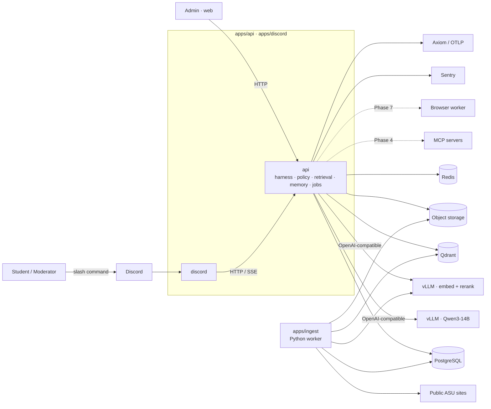
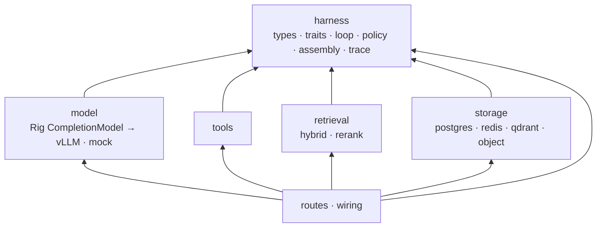
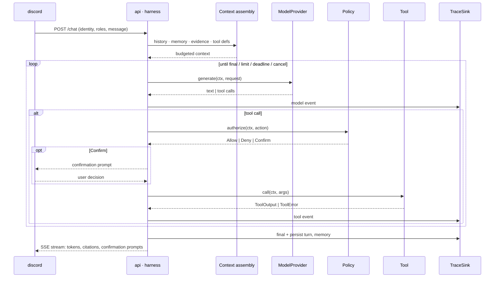
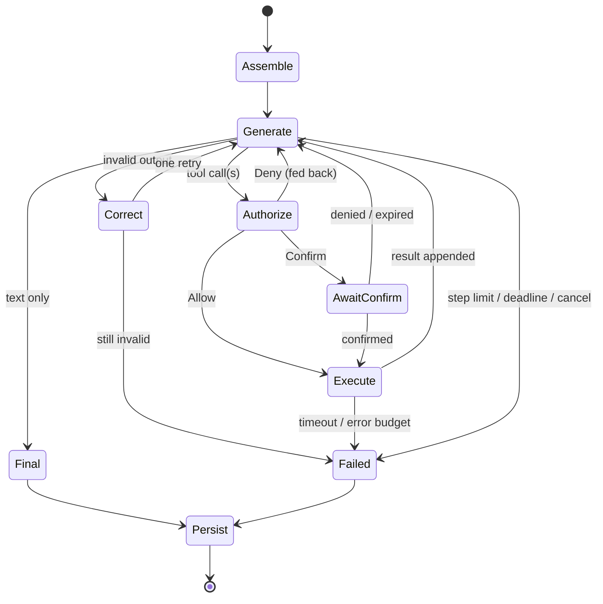
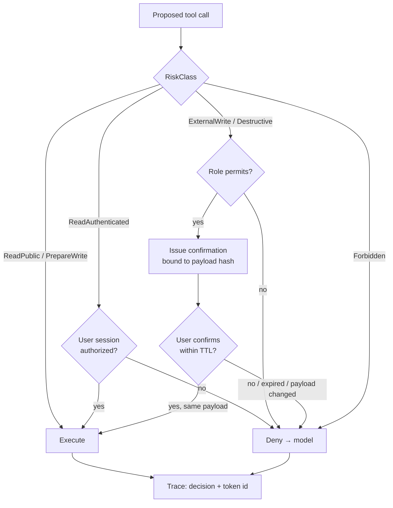
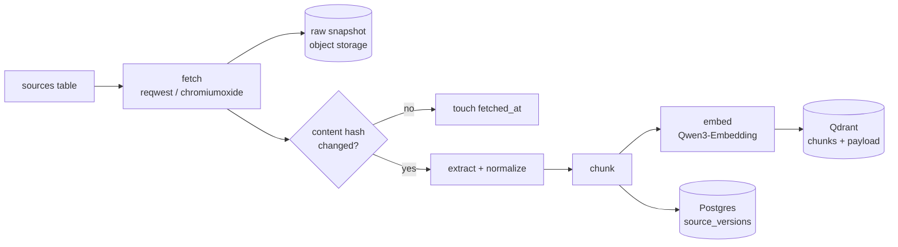
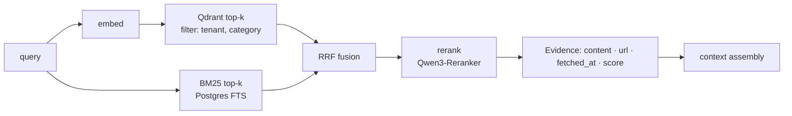
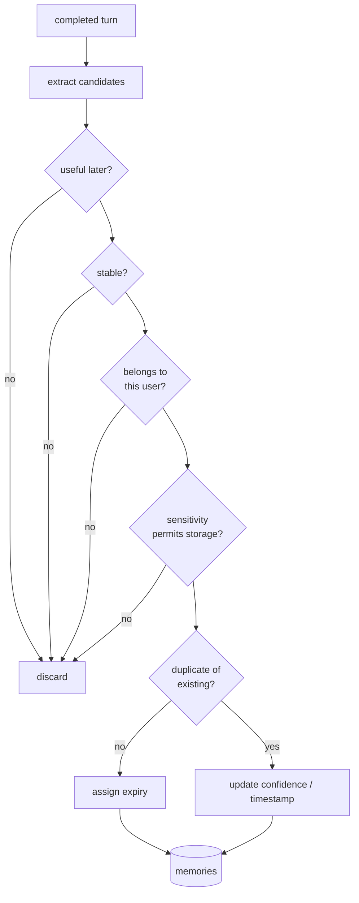
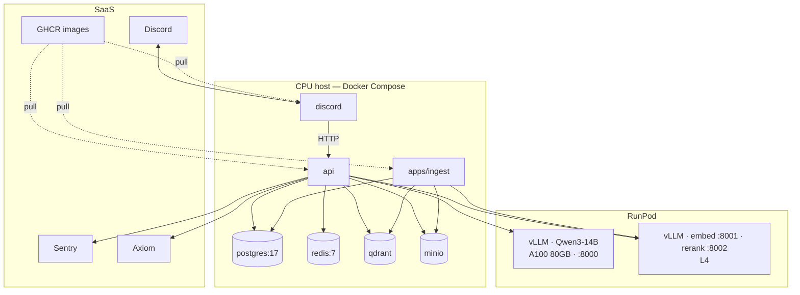

# Architecture

SparkyAI is a Discord copilot for the AI Society at ASU. It answers questions from public ASU sources, keeps conversation and user memory, and performs moderator actions in Discord. Later phases add MCP tools and a sandboxed browser for authenticated tasks.

One repository; `apps/` holds every deployable — `api` and `discord` (Rust), `ingest` (Python), `inference` (vLLM config), `web` (static), `sandbox` (Phase 7). No shared library layer: `api` is one crate with strict module boundaries. Services never call each other except at three edges — `discord → api`, `api → vLLM / MCP / sandbox` — everything else goes through the datastores, whose schema is the contract.

Order of work is in [ROADMAP.md](ROADMAP.md). This document describes the target shape.

## System context



Solid arrows exist or are in the current phase; dashed are later phases. Only `ING` touches `WEB`.

## Rules

- Open models only, served by vLLM behind an OpenAI-compatible HTTP API.
- Facts come from retrieval or live observation, never from model weights.
- Public sites are ingested offline. The request path never fetches a web page.
- Every request carries its own `RequestContext`. No global mutable state.
- Every replaceable dependency is a trait in `api/src/harness` with a mock for tests.
- Rig supplies model clients, tool schema, embeddings, and vector-store adapters. The harness owns the loop, policy, context, memory, and tracing. We do not use `rig::Agent`.
- Model output is never written back as retrieval evidence.
- Anything that creates, changes, submits, posts, books, or deletes requires confirmation immediately before the action.
- Credentials, cookies, and authenticated page content never enter retrieval indexes, memory, or traces.

## Layout

```
apps/
  api/            Rust bin. The backend: HTTP routes + harness + retrieval + memory + storage.
    src/harness/    types, traits, agent loop, context assembly, JSONL tracing — imports nothing else
    src/model/      Rig CompletionModel wiring for vLLM; mock
    src/tools/      built-in Tool impls
    src/retrieval/  query side: embed → dense + BM25 → fuse → rerank → Evidence
    src/storage/    Postgres, Redis, Qdrant, object-store adapters
    src/routes/     chat, health, admin
    src/{config,telemetry,wiring}.rs
    migrations/     the schema contract
  discord/        Rust bin: serenity bot; HTTP/SSE client of api. Never links api.
  ingest/         Python worker: fetch → snapshot → extract → chunk → embed → index
  inference/      vLLM on RunPod: env files and start script
  web/            static frontend + admin UI (Vite + React)
  sandbox/        Phase 7 browser worker
models/           Python: datasets, training, eval runners
evals/            shared eval cases (data only)
deploy/           compose + one Dockerfile per image
```

Everything that runs is under `apps/`. Language is never a folder. ASU domain (library, events, …) is never a folder either — it is a row in `sources` or an entry in a registry.

## Modules inside `api`



Dependency direction inside the crate: `routes`/`wiring` → adapters → `harness`. `harness` imports nothing else. Adapter modules import only `harness`, never each other. This is a convention checked in review, not by the compiler. Between apps it *is* enforced: `scripts/check-deps.sh` fails if `discord` and `api` ever depend on each other. `[workspace.lints]` applies code rules to both. Every module is scaffolded with a doc comment stating its responsibility; fill in place.

## Types

```rust
pub struct UserEvent {
    pub request_id: RequestId,
    pub source: EventSource,        // Discord, Http
    pub tenant_id: TenantId,        // the Discord guild; keeps data scoped
    pub user_id: UserId,
    pub channel_id: ChannelId,
    pub content: MessageContent,
    pub received_at: DateTime<Utc>,
}

pub struct RequestContext {
    pub request_id: RequestId,
    pub tenant_id: TenantId,
    pub user: UserIdentity,
    pub roles: Vec<Role>,
    pub conversation_id: ConversationId,
    pub deadline: Instant,
    pub cancel: CancellationToken,
    pub trace: TraceContext,
}

pub struct Evidence {
    pub source_id: SourceId,
    pub document_id: DocumentId,
    pub title: String,
    pub content: String,
    pub url: Option<Url>,
    pub fetched_at: DateTime<Utc>,
    pub score: f32,
}
```

Citations are built from `Evidence`, not parsed out of generated text.

## Traits

All in `api/src/harness`. Inputs and outputs are owned Sparky types; provider JSON stays inside adapters. `ModelProvider` and `Tool` are thin wrappers over Rig's `CompletionModel` and `Tool`, adding `RequestContext` and `RiskClass`.

```rust
#[async_trait]
pub trait ModelProvider {
    async fn generate(&self, ctx: &RequestContext, req: ModelRequest) -> Result<ModelStream, ModelError>;
}

#[async_trait]
pub trait Tool {
    fn definition(&self) -> ToolDefinition;   // name, description, JSON schema, RiskClass
    async fn call(&self, ctx: &RequestContext, args: Value) -> Result<ToolOutput, ToolError>;
}

#[async_trait]
pub trait Retriever {
    async fn retrieve(&self, ctx: &RequestContext, q: RetrievalQuery) -> Result<Vec<Evidence>, RetrievalError>;
}

#[async_trait]
pub trait ConversationStore {
    async fn load(&self, ctx: &RequestContext) -> Result<Vec<Message>, StoreError>;
    async fn append(&self, ctx: &RequestContext, turn: Turn) -> Result<(), StoreError>;
}

#[async_trait]
pub trait MemoryStore {
    async fn recall(&self, ctx: &RequestContext, q: MemoryQuery) -> Result<Vec<Memory>, MemoryError>;
    async fn write(&self, ctx: &RequestContext, m: MemoryCandidate) -> Result<Option<MemoryId>, MemoryError>;
    async fn forget(&self, ctx: &RequestContext, id: MemoryId) -> Result<(), MemoryError>;
}

#[async_trait]
pub trait Policy {
    async fn authorize(&self, ctx: &RequestContext, a: ProposedAction) -> Result<Decision, PolicyError>;
    // Decision: Allow | Deny(reason) | Confirm(ConfirmationRequest)
}

pub trait TraceSink {
    fn emit(&self, ctx: &RequestContext, e: TraceEvent);
}

#[async_trait]
pub trait Sandbox {   // Phase 7
    async fn run(&self, ctx: &RequestContext, t: BrowserTask) -> Result<BrowserResult, SandboxError>;
}
```

## Request lifecycle

1. `discord` receives the slash command and POSTs it to `api` with the Discord identity and roles. (Web and admin clients hit the same endpoint.)
2. `api` normalizes it into `UserEvent`, resolves roles and permissions → `RequestContext`.
3. Load conversation; recall memory; retrieve evidence if the query needs it.
4. Assemble context within a token budget, in fixed order: system instructions (versioned) → role/permissions → current request → relevant turns → memory → evidence → tool definitions. Tool output and evidence are truncated before old history is.
5. Call the model; validate structured output. One correction attempt on invalid output, then stop.
6. For each proposed tool call: `Policy::authorize` → Allow / Deny / Confirm.
7. Execute allowed calls with timeout and cancellation. Parallel when independent.
8. Loop until final answer, error, cancel, deadline, or step limit.
9. Persist turn, memory candidates that pass the write policy, and trace.
10. Reply with citations.



Agent loop states:



## Tool risk classes

| Class | Examples | Behavior |
|---|---|---|
| `ReadPublic` | search indexed pages, library hours | run |
| `ReadAuthenticated` | read a page in the user's own browser session | run after session authorization |
| `PrepareWrite` | draft an announcement, fill a form without submitting | run |
| `ExternalWrite` | post, create ticket, book, submit | confirm immediately before |
| `Destructive` | delete, cancel | confirm immediately before |
| `Forbidden` | another user's session, bypassing policy | deny |

A confirmation is bound to one exact action payload, is single-use and short-lived, states what happens / where / with what data / whether reversible, and is recorded in the trace. If the payload changes, confirm again. External writes are never auto-retried without an idempotency key.



## Knowledge

Offline pipeline in `apps/ingest` (Python): fetch → raw snapshot to object storage → extract → normalize → dedupe → chunk → embed → index. Each document records canonical source, fetch time, content hash, parser/chunker/embedding versions, and its previous version on change.

Request path: hybrid retrieval (dense + BM25) → rerank → `Evidence` with `fetched_at`. If nothing is found or the source is stale, the answer says so.

Ingestion (`apps/ingest`, offline):



Retrieval (request path):



## Memory

| Kind | Content |
|---|---|
| Working | current request; not persisted |
| Conversation | turns and tool results |
| Episodic | a useful event from a prior interaction |
| Semantic | a stable inferred fact |
| Profile | approved preferences, interests, goals |
| Task | state to continue a multi-step job |

A candidate is written only if it is useful later, stable, belongs to this user, permitted by its sensitivity class, not a duplicate, and has an expiry. Recall filters by `tenant_id` and `user_id` before ranking; the interface cannot express a cross-user query. Users can view and delete their memory (Phase 4). Conflicting memories keep provenance and timestamps; newer and higher-confidence wins at assembly time, nothing is silently rewritten.

Write path:



## Storage

| Data | Store |
|---|---|
| users, roles, conversations, messages, memories, source metadata and versions, jobs, confirmations | PostgreSQL (source of truth) |
| chunk embeddings with `source_id`, `version`, `category`, `fetched_at` | Qdrant (rebuildable; Piramid later) |
| rate limits, queue, short-lived cache | Redis |
| raw snapshots, model artifacts | object storage |
| browser session secrets | encrypted, separate namespace |
| traces | JSONL locally; OpenTelemetry in deployment |

Redis may carry the queue; durable job state lives in Postgres so a Redis restart loses nothing.

## Background jobs

Discord handlers never block on long work. Ingestion, embedding, browser tasks, reminders, evals, and trace processing run as jobs with id, owner, type, status, input ref, attempts, deadline, cancel state, result ref, and error category.

## Failure behavior

| Failure | Response |
|---|---|
| model unavailable | retry within deadline, then clear error |
| invalid tool call from model | one correction, then stop |
| tool timeout | cancel, trace, report |
| retrieval empty | say so; do not guess |
| sources conflict | show both with dates |
| confirmation denied or expired | do nothing |
| write result unclear | do not retry; inspect final state |
| Postgres unavailable | reject stateful requests rather than run without identity or policy |
| trace sink unavailable | continue only with a bounded local fallback |

## Tracing

One trace per request covering every model call, retrieval, memory access, tool call, policy decision, confirmation, and error. Records ids, model/prompt/template versions, evidence and memory ids, validated tool args, timings, tokens, final status. Never passwords, cookies, auth codes, tokens, or raw sensitive form values. Any request can be replayed from its trace against a chosen model, prompt, tool set, and retrieval snapshot; that is the eval harness.

## Sandboxed browser (Phase 7)

Separate worker process, never inside the app process. One isolated browser context per user session; the user completes login and MFA themselves; SparkyAI never asks for or stores a password. Allowlisted domains, blocked or quarantined downloads, size-limited structured observations, redacted action logs, session expiry and cleanup. CAPTCHA, MFA failure, expired session, or an unexpected page stops the task. Authenticated page content is never indexed or memorized. Requires explicit authorization before work begins (see roadmap out-of-scope).

## Deployment

Two images: `sparkyai-rust` (contains both `api` and `discord`; entrypoint selects) and `sparkyai-ingest`. Plus Postgres, Redis, Qdrant, object storage, and vLLM on RunPod. Docker Compose first. Browser workers are added in Phase 7 as separate containers. Split further only on a measured need: independent scaling, failure isolation, hardware, or a security boundary.



## First vertical slice (Phase 1–3 target)

Discord slash command → `discord` → `POST /chat` on `api` → `UserEvent` → `RequestContext` → load conversation → vLLM via Rig → one `ReadPublic` tool → `Policy` allows → typed output → final answer streamed back → conversation and JSONL trace stored. Then retrieval (with `apps/ingest` feeding it), memory, MCP, browser — in that order.

## Open decisions

Exact Qwen model and quantization · embedding model · reranker · queue implementation · object-storage provider · browser engine and worker protocol · memory retention periods · moderator access to user conversations and traces · MCP servers in-process vs child process vs remote · when Qdrant moves to Piramid · app server host.

Record each as a short note under `docs/decisions/` when made.
