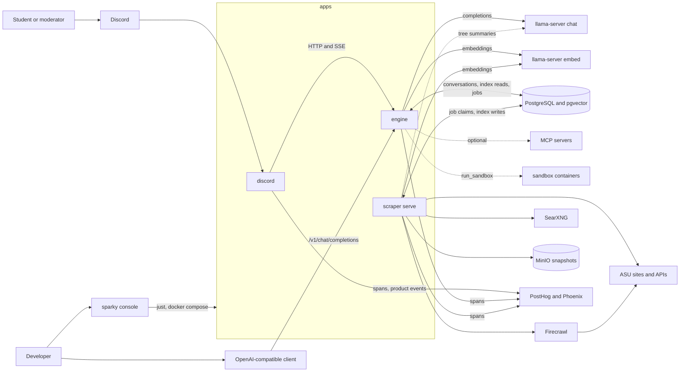
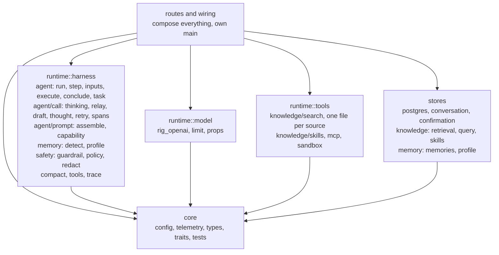
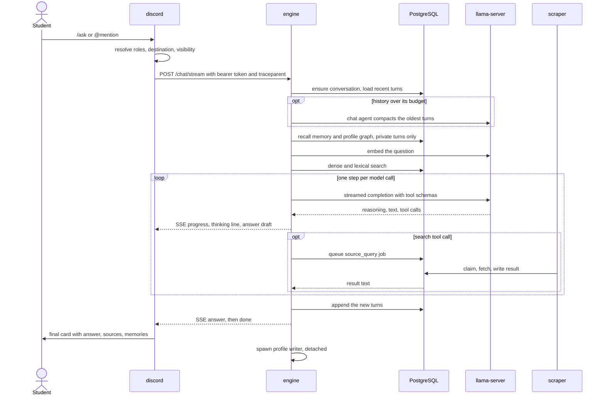
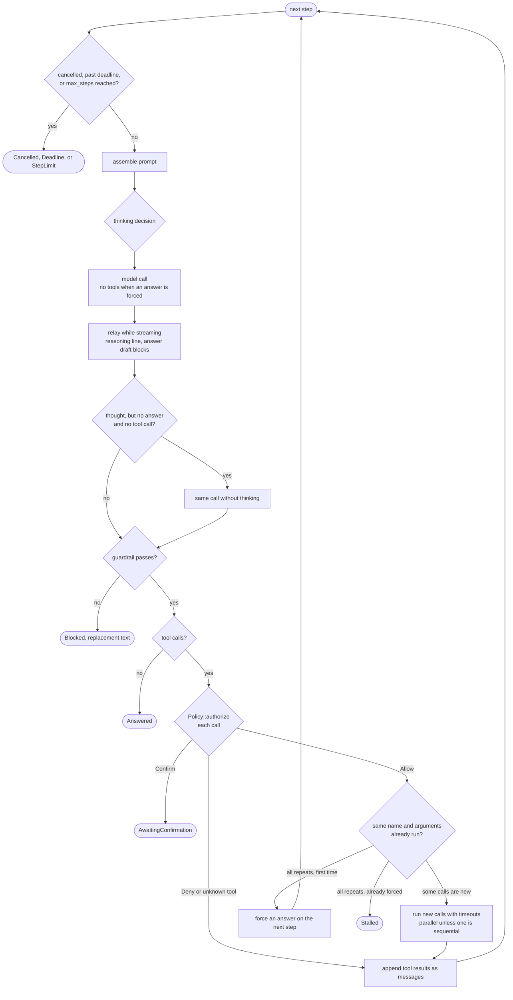
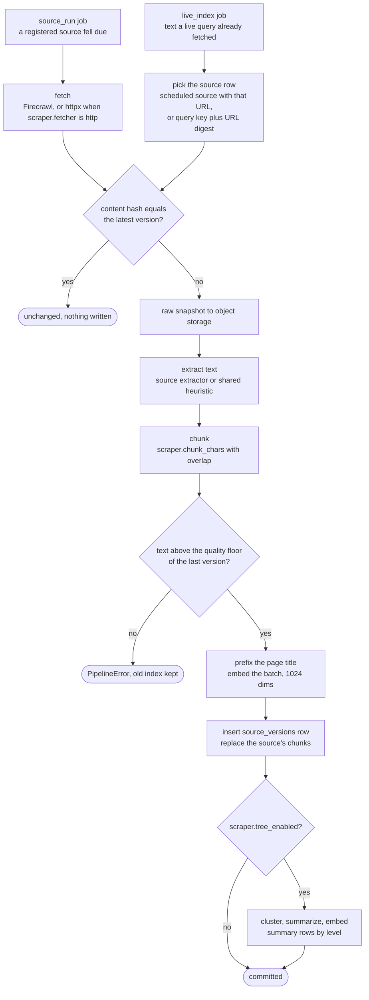
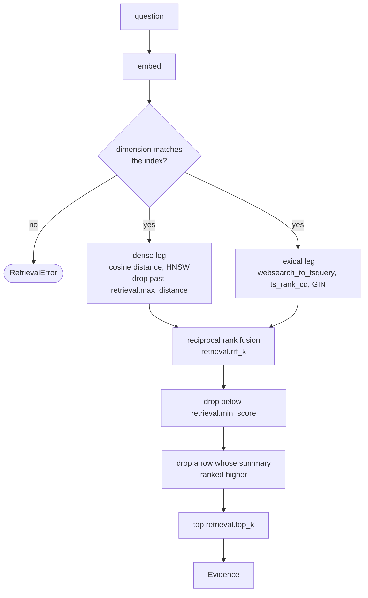
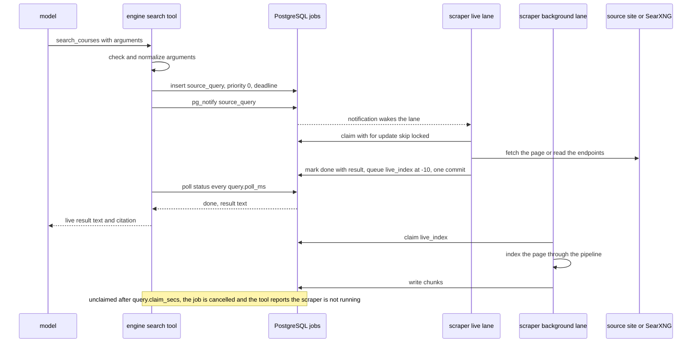
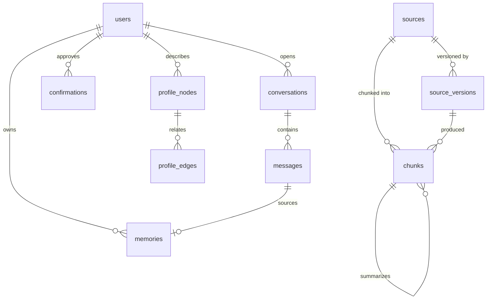
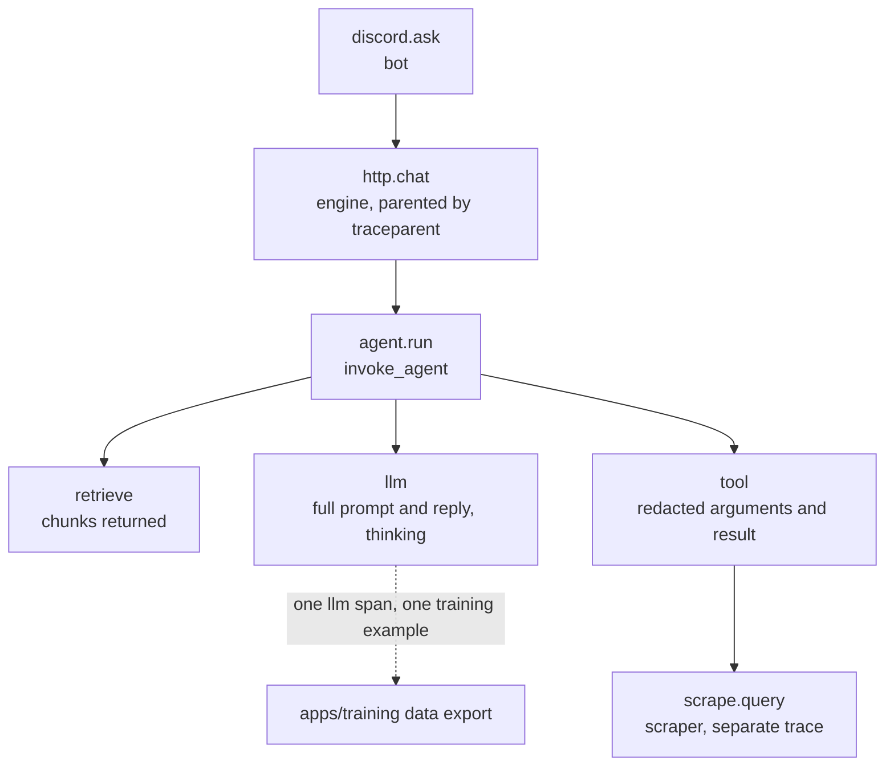
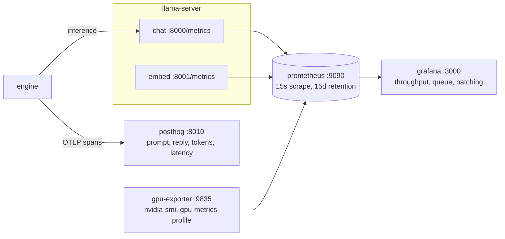

# Architecture

SparkyAI is a Discord copilot for the AI Society at ASU. It answers questions from public ASU sources, keeps conversation history and a profile of each user, and gates moderator actions behind policy and confirmation.

This document describes the current shape of the system and the rules it keeps. Order of work is in [ROADMAP.md](ROADMAP.md). Decisions are recorded in the commits that settle them.

## Stack

| Layer | Choice | Where |
|---|---|---|
| Engine, Discord bot, console | tokio, axum, serenity, ratatui, serde, thiserror, figment | `apps/engine`, `apps/discord`, `apps/cli` |
| Model and embed clients | Rig (`rig-core`) OpenAI-compatible client | `apps/engine/src/runtime/model/rig_openai.rs` |
| MCP | `rmcp` | `apps/engine/src/runtime/tools/mcp.rs` |
| Scraper | psycopg, httpx, BeautifulSoup, boto3, typer | `apps/scraper` |
| Page rendering | Firecrawl, self-hosted | `deploy/compose.yml` profile `crawl` |
| Web search | SearXNG, self-hosted | `deploy/compose.yml` profile `search` |
| Web | Vite, React, TypeScript, shadcn | `apps/web` |
| Post-training | Unsloth QLoRA, TRL, TensorBoard, GGUF | `apps/training/posttrain` |
| Evals | golden cases against the engine, baseline gate | `apps/training/evals` |
| Chat model | Qwen3 GGUF on `llama-server` | compose service `chat`, profile `model` |
| Embeddings | Qwen3-Embedding-0.6B, 1024 dimensions, on `llama-server` | compose service `embed`, profile `model` |
| Database, vector store, job queue | PostgreSQL 17 with pgvector | schema in `apps/scraper/migrations` |
| Object storage | S3-compatible, MinIO locally | `apps/scraper` |
| Cache | Redis 7, provisioned and unused | `deploy/compose.yml` |
| Observability | OpenTelemetry spans to PostHog and Phoenix, product events to PostHog, JSONL traces and logs under `.sparky/` | profiles `posthog`, `phoenix`, `metrics` |
| Config | `sparky.toml`, then `SPARKY_*` env vars | `sparky.toml`, `.env.example` |
| Build, gate | `just` recipes, pre-commit hook, CI | `justfile`, `.githooks`, `.github/workflows` |
| Deploy | Docker Compose, prod pulls GHCR images | `deploy/` |

## Rules

- Open models only, served by `llama-server` behind an OpenAI-compatible HTTP API.
- Facts come from retrieval or from a live source query, never from model weights.
- The engine never fetches a page. The scraper fetches, on a schedule or for a live query job, and is the only writer of the retrieval index.
- The engine and the scraper are the only processes with database connections. They share the schema in `apps/scraper/migrations`, not code.
- Every request carries its own `RequestContext`. There is no global mutable state.
- Every replaceable dependency is a trait in `engine/src/core/traits` with a test double in `core/tests/support`.
- The harness owns the loop, policy, context assembly, memory, and tracing. Provider JSON never leaves `runtime/model`.
- Model output is never written back as retrieval evidence.
- An action at or above `policy.confirm_from` is held for the caller's approval immediately before it runs.
- Credentials, cookies, and authenticated page content never enter the retrieval index, memory, or traces.

## Layout

```
apps/
  engine/         Rust bin. The agent, its HTTP surface, and the store adapters.
    src/core/       config (services, http, harness by domain), telemetry, types, traits, tests
    src/runtime/    harness (loop, prompt, memory, safety, compaction, trace), model (Rig client, slot limit, server props), tools (search, skills, mcp, sandbox)
    src/stores/     postgres adapters: conversation, confirmation, knowledge (retrieval, query jobs, skills), memory (memories, profile graph)
    src/routes/     chat (JSON and SSE), confirm, conversation, profile, openai (/v1), health, rate limit
    src/wiring.rs   builds every dependency from config and serves
  discord/        Rust bin. serenity bot and HTTP client of the engine. Never links it.
    src/core/       config, telemetry, types, tests
    src/bot/        client, slash commands, mentions, approvals, the streamed turn
    src/engine/     HTTP client of the engine and SSE frame parsing
    src/render/     the turn card, reply text, buttons and their custom ids
    src/access/     roles, permissions, and where a turn is answered
    src/analytics/  product events to PostHog, a bounded queue flushed in the background
  cli/            Rust bin sparky. Developer console: runs just recipes and compose services and tails them.
    src/core/       config, types, tests
    src/app/        console state, key map, control, rendering
    src/units/      unit catalog, process runner, log buffers, health probes
  scraper/        Python. Scheduled ingestion and the worker for live query jobs.
    core/           settings, types, telemetry, tests
    ingest/         fetch, extract, chunk, embed, tree, pipeline
    sources/        scheduled sources, one module each
    query/          live query registry, parameter checks, runner, indexing of live results
    query/sources/  live query sources, one module each
    jobs.py         the job queue: handlers, lanes, scheduling
    store/          postgres and object storage, the only place a connection opens
    migrations/     the schema
  training/       Python. Datasets from PostHog llm spans, evals with a baseline gate, SFT to GGUF.
  web/            Vite and React frontend and admin UI
deploy/           compose (dev and prod), Dockerfiles, inference, monitoring, posthog, search
docs/             ROADMAP.md, this file
.sparky/          ignored local state: traces, logs, training data, reports
```

Each Python app directory is its own importable package (`apps/scraper` is `scraper`) with no `src/` layer. `pyproject.toml` maps the package to `.` and lists its subpackages, so a new subpackage is added there.

Every app has a `core/` holding config, telemetry, data types, interfaces, and tests. Domain modules import from it. It imports nothing from them.

Language is never a folder. ASU domain (library, events) is never a folder either. It is a module in a source registry and a row in `sources` or `query_sources`.

## System context



Processes talk only at these edges. The engine and the scraper meet only in PostgreSQL: the engine queues a job and reads its row, the scraper claims it and writes the result. Only the scraper reaches the web. MCP servers are optional and none is configured by default.

The engine serves `/chat` and `/chat/stream` for the bot and `/v1/chat/completions` for OpenAI-compatible clients. All three run the same loop. Every route except health and `/v1/models` requires the bearer token in `SPARKY_ENGINE__SERVICE_TOKEN` and applies the per-user `http.rate_limit_per_min`.

The console starts and stops the other units and tails their output. It does not start a process whose port something else already serves, and says so instead.

## Inside engine



`core` imports nothing else in the crate. `runtime::harness`, `runtime::model`, `runtime::tools`, and `stores` import only `core`. `routes` and `wiring` compose them. `scripts/check-deps.sh` enforces that the three Rust apps never depend on each other.

Folders nest by domain, and the same domain names repeat across `core/types`, `core/traits`, `core/tests`, `runtime`, and `stores`: agent, conversation, http, knowledge, memory, model, safety, tools, trace. A domain with one file at a level keeps that file flat. Data lives in `core/types`, interfaces in `core/traits`, and stateful objects beside their implementations.

`runtime::model::limit` wraps the chat client in a semaphore of `agent.model_slots` permits, matching `llama-server --parallel`. A call waits up to `agent.model_queue_wait_secs` for a slot, then fails as busy.

## Inside scraper

`store/` is the only place the scraper opens a connection. `migrations/` is the schema contract with the engine. The scraper writes `sources`, `source_versions`, `chunks`, `query_sources`, and job results. The engine reads the index and writes conversations, confirmations, the profile graph, and `source_query` jobs. `ingest/embed.py` uses the same model and dimension the engine queries with, so changing the embedding model means re-embedding every chunk.

`sources/` holds scheduled sources: a URL, a category, an interval, and an optional extractor. `query/sources/` holds live query sources: parameters with their choices, and either a URL builder with an extractor or an `answer` function that reads several endpoints.

## Types

```rust
pub struct RequestContext {
    pub request_id: Uuid,
    pub tenant_id: String,
    pub user_id: String,
    pub roles: Vec<String>,
    pub conversation_id: Uuid,
    /// Public when anyone but the caller can read the answer.
    pub visibility: Visibility,
    pub deadline: Instant,
    pub cancel: CancellationToken,
    /// Live progress goes here while a caller is watching; None for a plain request.
    pub progress: Option<UnboundedSender<Progress>>,
}

pub struct Evidence {
    pub source_id: Uuid,
    pub chunk_id: Uuid,
    pub title: String,
    pub content: String,
    pub url: Option<String>,
    pub fetched_at: DateTime<Utc>,
    pub score: f32,
}
```

Citations are built from the `Evidence` that fit the prompt and from the pages tools read (`Answer.sources`), not parsed out of generated text.

## Traits

All in `engine/src/core/traits`. Inputs and outputs are owned types from `core/types`. The main ones:

```rust
#[async_trait]
pub trait ModelProvider {
    async fn generate(&self, ctx: &RequestContext, req: ModelRequest) -> Result<ModelResponse, ModelError>;
    // The same completion, sending each reasoning and text piece to deltas as it arrives.
    async fn stream(&self, ctx: &RequestContext, req: ModelRequest, deltas: UnboundedSender<ModelDelta>) -> Result<ModelResponse, ModelError>;
}

#[async_trait]
pub trait Tool {
    fn definition(&self) -> ToolDefinition;   // name, description, JSON schema, risk, sequential, timeout
    async fn call(&self, ctx: &RequestContext, args: Value) -> Result<ToolOutput, ToolError>;
}

#[async_trait]
pub trait Retriever {
    async fn retrieve(&self, ctx: &RequestContext, query: &RetrievalQuery) -> Result<Vec<Evidence>, RetrievalError>;
}

#[async_trait]
pub trait Embedder {
    async fn embed(&self, texts: &[String]) -> Result<Vec<Vec<f32>>, RetrievalError>;
    fn dim(&self) -> usize;
}

#[async_trait]
pub trait SourceQueries {
    async fn sources(&self) -> Result<Vec<QuerySourceInfo>, QueryError>;
    async fn run(&self, ctx: &RequestContext, request: &QueryRequest) -> Result<QueryOutcome, QueryError>;
}

#[async_trait]
pub trait ConversationStore {
    async fn ensure(&self, ctx: &RequestContext, channel_id: &str) -> Result<(), StoreError>;
    async fn owns(&self, ctx: &RequestContext) -> Result<bool, StoreError>;
    async fn load(&self, ctx: &RequestContext, limit: usize) -> Result<Vec<Message>, StoreError>;
    async fn append(&self, ctx: &RequestContext, turns: &[Message]) -> Result<(), StoreError>;
    async fn latest(&self, ctx: &RequestContext, channel_id: &str) -> Result<Option<Uuid>, StoreError>;
    async fn end(&self, ctx: &RequestContext, channel_id: &str) -> Result<u64, StoreError>;
}

#[async_trait]
pub trait MemoryStore {
    async fn recall(&self, ctx: &RequestContext, q: &MemoryQuery) -> Result<Vec<Memory>, StoreError>;
    // No write method yet.
}

#[async_trait]
pub trait Policy {
    async fn authorize(&self, ctx: &RequestContext, action: &ProposedAction) -> Decision;
    // Decision: Allow | Deny { reason } | Confirm(ConfirmationRequest)
}

#[async_trait]
pub trait Guardrail {
    async fn check(&self, ctx: &RequestContext, stage: Stage, text: &str) -> Verdict;
}

pub trait TraceSink {
    fn emit(&self, ctx: &RequestContext, event: TraceEvent);
}
```

The rest follow the same pattern: `Compactor`, `ConfirmationStore`, `SkillStore`, `ProfileGraph`, `FactDetector`, `Sandbox`.

## Request lifecycle



1. `discord` receives a slash command or a mention and posts it to the engine with the Discord identity, role names, the channel it answers in, the visibility of that answer, and `continue_channel`.
2. The engine checks the bearer token and the per-user rate limit, then builds a `RequestContext`. A given `conversation_id` must belong to the caller. Without one, `continue_channel` continues the caller's newest open conversation in that channel at that visibility, and otherwise a new conversation starts.
3. The loop loads inputs once: the last `agent.history_turns` turns, compacted if they overflow the history budget; memories and the profile graph, unless the request is public and `agent.recall_in_public` is off; and evidence from retrieval for the question.
4. The loop runs steps until it stops. On `/chat/stream` each progress event goes out as an SSE frame while the step runs.
5. Every exit appends the new turns, hands the user's text to the profile writer, and builds the answer with its citations, tool runs, memories (empty for a public answer), usage, and cost.
6. An answer with status `AwaitingConfirmation` carries a token. `POST /confirm` with that token runs the held action and resumes the loop from its result.

## Prompt assembly

Each step assembles the prompt in a fixed order:

1. System instructions, the role line, and today's date.
2. The capabilities section, if it fits `agent.capabilities_budget_tokens`.
3. Memory, within `agent.memory_budget_tokens`.
4. Evidence, numbered for citation, within `agent.evidence_budget_tokens`. Each entry is labelled a stored copy with its fetch date and age, and `prompt.evidence_header` tells the model to call the matching search tool when the question needs current information or the entries do not answer it. With no evidence, `prompt.no_evidence_line` tells the model to call a search tool or say it does not know.
5. History, newest first within `agent.history_budget_tokens`, never starting on an orphaned tool result.
6. The user's input, then the model and tool turns of this request.

Tool schemas are sent beside the messages and are charged to `agent.prompt_budget_tokens` first. Evidence and history are capped by what remains. The system prompt, the input, and this request's tool exchange are never dropped. Token counts are estimates from `agent.chars_per_token`. MCP schemas are compacted and, by default, show only required properties.

## Agent loop



The loop owns every stopping condition. It checks cancellation, the deadline, and `agent.max_steps` before each step.

Thinking is decided per model call by `agent.thinking`. `on` and `off` apply to every call. In `auto` the first matching rule wins: a call with no tools does not think; a step after tool results thinks when `after_tools` is set; a question with a cue word, longer than `max_quick_chars`, or with no evidence thinks; anything else does not. A call that thinks gets `model.max_tokens`, and one that does not gets `model.max_tokens_without_thinking`. A call that thought and returned neither an answer nor a tool call is made once more without thinking when `retry_without` is set. The `llm` span records `sparky.thinking` and `sparky.thinking_reason`. Prompted sub-agents never think.

With `agent.stream` on, the model call streams. Reasoning updates the thinking line as it grows. When answer text begins, the thinking line becomes the full thought, clipped to `agent.progress_thought_chars`. Answer text is released as a draft at the end of a sentence or line, or at a word break past `agent.stream_block_chars`, and every block passes the guardrail before it is sent. A draft is withdrawn when the call ends in tool calls, fails, or a block is refused. A step that answers without showing a thought takes its thinking line back.

Every response passes the guardrail: the answer stage for a final answer, the capability stage for a response with tool calls and text. `Policy` decides whether a typed action may run by its risk class. The guardrail decides whether a response may proceed at all.

Tool calls are authorized before any runs. A denial or an unknown tool name becomes a tool result the model reads. The first call that needs confirmation is stored in `confirmations` and ends the run. Allowed calls that repeat an earlier call with identical arguments are not run again, and the model is told so. When every call in a step is a repeat, the next step offers no tools and adds `prompt.answer_only_line`. If that step repeats again, or answers with nothing, the run ends as `Stalled`.

Allowed calls run in parallel, each under its own timeout (the tool's declared timeout or `agent.tool_timeout_secs`, capped by the request deadline). If any call is to a tool marked sequential, the step runs its calls in order. A tool error, including `InvalidArguments`, is fed back as the tool result so the model can correct the call on its next step.

A retryable model error (transport, 5xx, 429) is retried with backoff up to `agent.max_model_retries`. A model timeout ends the run as `Deadline`, cancellation as `Cancelled`, and any other error keeps the turns and returns the error.

## Prompted sub-agents

The harness runs more than one prompt. Each sub-agent is a `runtime::harness::agent::task::Task`: its own instructions, one model call, no tools, no thinking, and a typed result. The loop does not use `Task`, because it has tools and stopping conditions.

| Agent | When | Reads | Writes |
|---|---|---|---|
| Sparky (the loop) | every request | evidence, memory, history, capabilities | the turn |
| Chat | loaded history overflows its budget | the turns being replaced | one compacted turn |
| Graph | after a turn, when the detector passes it | the user's text | profile facts |
| Reconcile | a new fact collides with recorded ones | the new fact and the candidates | which recorded facts to withdraw |

## Capabilities

`runtime::harness::agent::prompt::capability` renders one `<capabilities>` list in the prompt. Each entry names its kind.

| Kind | Executed by | Risk |
|---|---|---|
| `tool` | a built-in `Tool`: the `search_<source>` tools, `get_skill`, `run_sandbox` | declared per tool |
| `mcp` | a remote MCP server | derived from the tool name |
| `skill` | fetched by `get_skill`, then followed | the risk of each capability it uses |

`tools.disabled` removes tools by name at registration. The engine refuses to boot when the capabilities section exceeds its budget or the tool schemas take more than half of `agent.prompt_budget_tokens`. It also refuses when the prompt budget plus `agent.prompt_estimate_headroom` and `model.max_tokens_without_thinking` do not fit one `llama-server` slot.

`run_sandbox` runs a command in a container with no network, a read-only root, memory, CPU, and process limits, and a non-root user. A call that names a session reuses a container that stays up for `sandbox.session_idle_secs`, so files written under /tmp persist between calls. Session containers are named from a hash of the tenant and user, so one caller cannot reach another's session.

A skill is a saved procedure: parameters, ordered steps, and the domain it applies to. `get_skill` fetches one, and the model follows it with the capabilities it already has. Only rows with `enabled` set are offered, and a row starts disabled, so a person reviews each skill before it is offered. With no enabled skill, `get_skill` is not registered.

## Compaction

Without compaction, history is trimmed to its budget by dropping the oldest turns. With `compaction.enabled`, the Chat agent replaces the turns that would be dropped with one compacted turn and stores it, so the next request starts from it. At least the newest turn is always kept. A failed compaction falls back to trimming.

A compacted turn is model output. It is stored with role `summary`, so a replayed conversation can tell it apart from what the user and the assistant said. It is never retrieval evidence, and the turns it replaced stay in `messages`.

A summary row records `covers_seq`, the `seq` of the last message it replaces. Loading history reads the newest summary and then up to `agent.history_turns` messages whose `seq` is greater than its `covers_seq`. The turns a compaction kept are stored before the summary, so they load again on the next request. A summary without `covers_seq` covers every message before its own `seq`.

The system prompt is not a stored message. It is rebuilt on every request and always comes first, so compaction never replaces it.

## Profile graph

Flat memory rows record what a user said. The profile graph records entities, the relations between them, and an embedding per node, so recall can start from a relation.

Extraction never runs in the request path. When a run ends, the loop spawns the profile writer with the user's text and returns. The writer has its own context and a deadline of `profile.timeout_secs`.

The gate is rules, not a model call, because it runs on every turn. `RuleDetector` passes a sentence with a first-person marker next to a stative cue and rejects questions and turns shorter than `profile.detector.min_words`. Only a turn that passes reaches the Graph agent. Facts below `profile.min_confidence` or with an empty label are dropped. A trained classifier can replace the rules through the `FactDetector` trait.

With `profile.reconcile` on, a new fact is checked against facts already recorded for the same subject and relation. The Reconcile agent names the recorded facts the new one makes false, and those are withdrawn. Two facts that can both be true are both kept. An answer that cannot be parsed, or a failed call, withdraws nothing.

Recall filters by `tenant_id` and `user_id` before ranking. Users list and delete what the graph holds with `/memory` and `/forget` (`POST /profile/list`, `POST /profile/forget`). Relations cascade from the node they run through.

## Memory

| Kind | Content | Status |
|---|---|---|
| Working | the current request | not persisted |
| Conversation | turns and tool results | `messages` |
| Episodic, semantic, profile, task | durable facts about a user | `memories`, read by recall |
| Profile graph | entities and relations | `profile_nodes`, `profile_edges` |

The engine recalls `memories` rows, unexpired and ordered newest and most confident first, and appends profile graph nodes and relations. It does not write `memories` rows yet. The schema carries `sensitivity`, `confidence`, `source_msg`, and `expires_at` for when it does.

A public request recalls no memory and no profile graph unless `agent.recall_in_public` is set. Only an answer no one else can read is private. A public answer never lists the memories its prompt carried.

## Tool risk classes

| Class | Examples | Default behavior |
|---|---|---|
| `ReadPublic` | `search_<source>`, `get_skill` | run |
| `ReadAuthenticated` | a page inside the user's own session | deny unless `policy.allow_authenticated_reads` |
| `PrepareWrite` | `run_sandbox`, a draft, a form filled without submitting | run |
| `ExternalWrite` | post, create a ticket, book, submit | require a `policy.write_roles` role, then confirm |
| `Destructive` | delete, cancel | require a `policy.write_roles` role, then confirm |
| `Forbidden` | another user's session, bypassing policy | deny |

The classes are ordered as listed. `policy.write_roles` gates `ExternalWrite` and above. `policy.confirm_from` names the lowest class held for approval, so a deployment can hold drafts too while a new tool is being trusted. `Forbidden` is denied regardless of settings. Defaults are `["MANAGE_GUILD"]`, `external_write`, and authenticated reads off.

A confirmation is bound to a hash of the exact arguments, belongs to the caller who was asked, is single use, and expires after `agent.confirmation_ttl_secs`. Its summary names the tool, the arguments, and whether the action can be undone. The policy decision is recorded in the trace.

## Knowledge

The retrieval index is `chunks`, written by the scraper and read by the engine. Two kinds of job write it: a scheduled run of a registered source, and the indexing of a page a live query fetched. Both go through the same pipeline in `ingest/pipeline.py`.



Each version records content hash, snapshot key, parser, chunker and embedding versions, text length, chunk count, and the previous version. The quality floor refuses a run whose text is under `scraper.quality_floor_ratio` of the last version, once that version had at least `scraper.quality_floor_min_chars`. An extractor break that returns only navigation is caught this way. `scraper run <source> --force` accepts such a run.

Retrieval runs in the engine before the first model call, over the same rows.



Each leg pulls `retrieval.candidates` rows from the caller's tenant and the `public` tenant. The dense leg drops a row farther than `retrieval.max_distance` from the question, so a question the index does not cover gets no evidence. Fusion combines ranks, not the legs' incompatible raw scores. Either leg can be turned off, but not both. A reranker is deferred until evals justify it.

### Hierarchical index

With `scraper.tree_enabled`, ingestion clusters the chunks of one source, writes a model summary of each cluster as a new row, embeds it, and repeats up to `scraper.tree_max_level`. A summary row lives in `chunks` beside the leaves, with a `level` above 0, and each leaf points at its summary through `parent_id`. The summaries use the `[summary]` model on the chat server.

Retrieval searches every level at once, so a query lands on whatever granularity answers it (the RAPTOR collapsed-tree approach). After fusion, a row whose summary already ranked higher is dropped. A chunk that outranks its own summary keeps both.

The tree is off by default. It costs a model call per cluster per level.

## Live source queries

Scheduled ingestion keeps the index current on an interval. A live query answers from a source now, with parameters the model picks: a term, subject and level of the class catalog, a scholarship search filtered by the student's situation, study room slots on a date, the next shuttle at each stop, a building on the campus map, a web search, or a refetch of this week's library hours.

The engine offers one tool per source, named `search_<source>`. The tool description tells the model what the source answers. The prompt tells it to use the evidence first and to call a search tool when the evidence does not answer.



A source has two halves, one file each. The engine side, `runtime/tools/knowledge/search/<source>.rs`, declares the description, the parameters, what each accepts (text, one of fixed choices, any of fixed choices, a date, a flag), and any extra check. Arguments are checked and normalized there, so a bad call is corrected by the model without queueing a job. The scraper side, `apps/scraper/query/sources/<source>.py`, turns those parameters into a fetch: one URL and an extractor, or an `answer` function that reads several endpoints itself (the shuttle tracker, campus map layers, news and video feeds, SearXNG).

`query_sources` is the registry the scraper publishes when `scraper serve` starts: each key with its parameters and choices. At boot the engine registers every tool in its catalog and logs a warning when a tool and the published source disagree on a parameter name, whether it is required, whether it takes a list, or a choice. A source the scraper has not published is still offered. The scraper checks the parameters of every query again before it runs it.

Any scraper failure (unknown source, missing parameter, unreadable page, an exception) marks the job failed. The tool returns the reason as `InvalidArguments`, which the loop feeds to the model. A caller that is cancelled or runs out of time cancels its job. The text handed back is held to `scraper.query_max_chars`, and the page is cited in `Answer.sources`.

`search_web` uses the same path against the open web. The scraper queries a self-hosted SearXNG (`just search`, `[search]` in `sparky.toml`) over Google, Brave, and Bing, and returns titles, links, dates, and snippets, cited as the Google search for the query. DuckDuckGo is excluded because it answers self-hosted searches with a CAPTCHA.

Not covered: X and Instagram posts (the public X timeline endpoint serves old posts and Instagram requires a login) and anything behind a student login, such as Workday jobs.

### Indexing live results

A live result answers its caller first and then becomes evidence. The job that stores the answer also queues a `live_index` job with the full fetched text, in the same commit. The background lane runs it through `pipeline.index_page`: hash, snapshot, extract, chunk, quality floor, embed, write, tree. A page whose URL is a scheduled source refreshes that source. Any other page gets its own `sources` row keyed by the query source and a digest of the URL, so the same search refreshes the same rows. The scheduler runs only registered sources and never refetches such a page.

A query source sets `index = False` when its answer goes stale within minutes or is not ASU content: `shuttles`, `study_rooms`, and `web`. `scraper.index_live_results` turns indexing off entirely. A failure to index fails only the `live_index` job and never reaches the caller.

## Job queue

The scraper does all its work from the `jobs` table in one process, `scraper serve` (`apps/scraper/jobs.py`).

| kind | queued by | priority | lane |
|---|---|---|---|
| `source_query` | the engine, for a `search_<source>` call | 0 | live |
| `live_index` | the scraper, with the answer to a `source_query` | -10 | background |
| `source_run` | the scraper, when a registered source falls due | -20 | background |

A claim takes the highest priority first, then the oldest, skipping jobs past their deadline, with `for update skip locked`, so several lanes and processes can claim at once. The live lane claims only `source_query` and wakes on the engine's `pg_notify`. The background lane claims the other kinds, so a long scrape never delays a live query. Both lanes also poll every `scraper.serve_poll_secs`.

Every `scraper.schedule_every_secs`, the main thread queues a `source_run` for each registered source that is due by its `fetch_every` and last attempt. A partial unique index allows at most one queued or running `source_run` per source. The same pass requeues background jobs left running longer than `scraper.job_lease_secs` by a stopped process.

`scraper status` shows each source and the queue by kind and status. `scraper run <source>` runs one source directly, outside the queue.

## Discord surface

| Entry | Where the answer goes | Visibility |
|---|---|---|
| `/ask` in a text channel | a thread opened from the question | public |
| mention in a text channel | a thread opened from the message, or inline if the thread cannot be made | public |
| `/ask` or mention in a thread | that thread | public |
| `/ask private:true` | an ephemeral reply | private |

A turn is one message, edited in place. It opens with a spinner header and gains one line per progress event. The engine writes the text of each line; the bot renders it and never keeps its own copy of the event enum. A line that carries a `slot` writes over the earlier line in that slot, so a tool result replaces its own start line. A `clear` event removes a line. A `draft` event sets or withdraws the answer shown under the steps. Edits are paced to one per `bot.edit_every_ms`, and a change inside the gap waits for the next edit.

The finished card shows the steps (the oldest fold into a count when space runs out), the answer, the memories the prompt carried (`ChatResponse.memories`), and sources without a URL. Sources with a URL are link buttons. Only an answer that still does not fit spills into further messages. An approval adds buttons to the card, and the resumed answer replaces the prompt on the same card.

A conversation belongs to one tenant, user, channel, and visibility. The bot holds no conversation state. `/reset` ends the caller's open conversations in the channel through `POST /conversation/reset`.

## Storage

| Data | Store |
|---|---|
| users, conversations, messages, memories, profile graph, confirmations, skills | PostgreSQL |
| sources, source versions, query source registry, jobs | PostgreSQL |
| chunk text, `vector(1024)` embedding, generated `tsvector` | PostgreSQL with pgvector, rebuildable from snapshots |
| raw page snapshots | object storage |
| local traces, console logs, training data | `.sparky/`, ignored |



`jobs`, `query_sources`, and `skills` stand alone. HNSW, GIN, and tenant, category, and fetch-time indexes serve retrieval. Redis is provisioned but unused until multiple engine replicas need shared ephemeral state.

## Failure behavior

| Failure | Response |
|---|---|
| model returns a retryable error | retry with backoff up to `agent.max_model_retries` within the deadline, then 502 |
| all model slots busy past `agent.model_queue_wait_secs` | 503, which the bot reports as temporary |
| model call outlives the request deadline | run ends as `Deadline` |
| tool argument error or scraper refusal | the reason becomes the tool result and the model corrects the call |
| tool timeout | `ToolError::Timeout` fed back as the tool result |
| scraper not running | unclaimed job cancelled after `query.claim_secs`, the tool says so |
| model repeats an identical tool call | repeat refused, next step offers no tools, `Stalled` if it repeats again |
| thinking spends the whole completion | the call is made again without thinking |
| prompt would exceed the budget | evidence and history are trimmed, the boot checks keep tool schemas under half |
| retrieval returns nothing | the prompt tells the model to search or say it does not know |
| guardrail blocks a response | run ends as `Blocked` with `guardrail.replacement` |
| confirmation denied, expired, or answered by someone else | nothing runs |
| PostgreSQL unavailable | the engine does not boot, and a request that needs a store gets 503 |
| JSONL trace over `trace.max_file_bytes` | later events for that request are dropped |

## Tracing

Every request produces one trace covering model calls, retrieval, memory recall, tool calls, policy decisions, guardrail blocks, and the outcome. The live pieces of a streaming call (reasoning so far, answer drafts, a withdrawn draft) go only to the watcher. The recorded trace keeps the finished call.



Traces go to three places:

- JSONL at `.sparky/traces/<request_id>.jsonl`: the complete local record of trace events.
- PostHog: spans exported over OTLP/HTTP to `telemetry.traces_path`. They carry `gen_ai.*` attributes, `posthog.distinct_id` for the user, and `$ai_session_id` for the conversation. `apps/training` reads `llm` spans from `posthog.trace_spans` to build datasets. `telemetry.ai_path` is empty by default because the self-hosted capture-ai service does not accept OTLP. Set it against PostHog Cloud.
- Phoenix: the same spans exported to `telemetry.phoenix_url` plus `/v1/traces`, without authentication, and read as a tree per conversation. Spans carry OpenInference attributes beside the `gen_ai.*` ones because the Phoenix UI reads those.

Each destination is independent: an empty project token turns PostHog off, and an empty `phoenix_url` turns Phoenix off. The scraper exports `scrape.source`, `scrape.index`, and `scrape.query` spans. The bot also sends product events to PostHog through a bounded queue (`[analytics]`). The local PostHog stack runs only the services traces, events, and the UI need.

Secrets, credentials, cookies, and sensitive form values are redacted from tool arguments and results before they reach any trace. The developer console mirrors followed stdout into `.sparky/logs/<unit>.log`. Deployments keep stdout with the platform log driver.

## Metrics

`llama-server` runs with `--metrics` and exports Prometheus format on its own port. Prometheus scrapes it and Grafana reads Prometheus. Both are opt-in (`just metrics`) and bind to loopback.



PostHog holds spans and events. Prometheus holds time series. A slow request shows as the `llm` span's latency in PostHog and as `llamacpp:requests_deferred` in Grafana for the same minute. Dashboard panels and their metric names are in `deploy/README.md`.

## Authenticated tasks (Phase 8)

Not built. The browser MCP server that Phase 8 assumed is gone, and nothing drives a page. Whatever replaces it needs a new design that meets these rules: the user completes login and MFA themselves, SparkyAI never asks for or stores a password, authenticated page content is never indexed or memorized, and any consequential submission is confirmed by the user.

## Configuration

Two layers, lowest first: `sparky.toml`, then `SPARKY_<SECTION>__<KEY>` environment variables, which win. `sparky.toml` is committed and holds every tunable value, so a change to retrieval fusion or a prompt budget is reviewed like code. `.env` is not committed and holds only secrets, per-machine URLs, and what docker compose and the justfile read. Both images copy `sparky.toml` in, and compose overrides the service URLs through the environment.

Rust reads the file with figment, Python with tomllib through pydantic-settings. `SPARKY_CONFIG_FILE` points at a different file, which is how an eval profile differs from the default. A missing file is not an error.

Sections in `sparky.toml`: `app`, `agent` (with `agent.thinking`), `prompt`, `model` (with `model.sampling`), `embedding`, `summary`, `retrieval`, `policy`, `tools`, `profile` (with `profile.detector`), `sandbox`, `guardrail`, `compaction`, `query`, `mcp`, `trace`, `telemetry`, `analytics`, `http`, `bot`, `postgres`, `scraper`, `search`, `firecrawl`, `object_store`, `cli`, `training`. The engine's `engine` and `discord` sections hold only env values: the service token and the guild id.

A default belongs to exactly one settings struct. Adapters build themselves from those structs and declare no defaults of their own. `Config::validate` rejects at boot any combination the engine cannot serve, for example both retrieval legs off, a section budget above the prompt budget, a sample ratio out of range, two MCP servers with the same name, a text search configuration that is not a plain identifier, or a zero query poll interval. A `prompt.system_file` that cannot be read also stops the boot. Nothing is clamped at runtime.

`prompt` holds the wording the harness writes around every section. `system_file` takes precedence over `system`, which takes precedence over the built-in prompt.

## Deployment

Two images: `sparkyai-rust` (engine and discord, selected by entrypoint) and `sparkyai-scraper` (runs `serve`). CD rebuilds only the images whose inputs changed. Datastores run beside them in Compose. `llama-server` runs as the compose services `chat` and `embed` under the `model` profile, configured in `deploy/inference`. Split further only on a measured need: independent scaling, failure isolation, hardware, or a security boundary. Details are in `deploy/README.md`.

## Open decisions

- Chat model size and quantization.
- Whether a reranker earns its place once the eval set exists.
- Parallel slots per `llama-server` under load.
- Default `chars_per_token` once the tokenizer is measured.
- Retention periods for memories and traces.
- Moderator access to user conversations and traces.
- App server host.

Record each in the commit that settles it.
