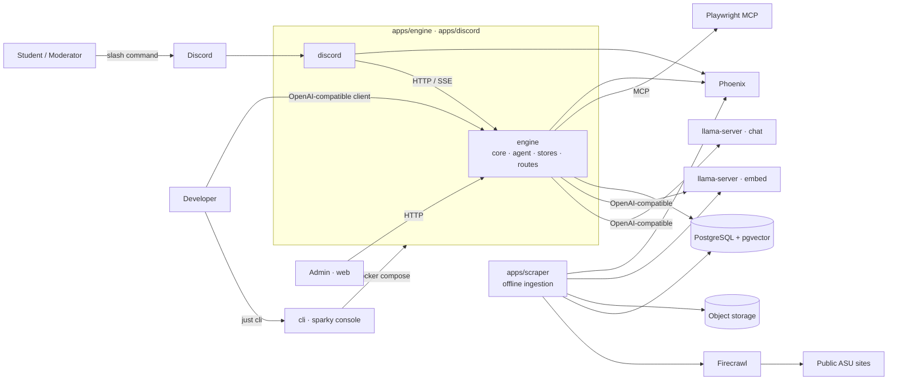
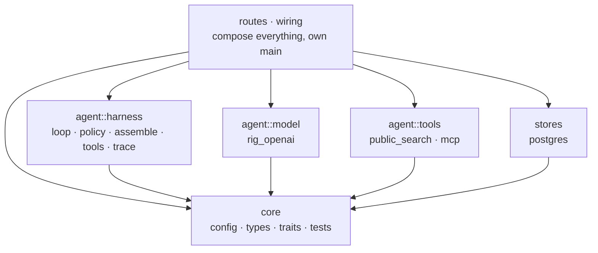
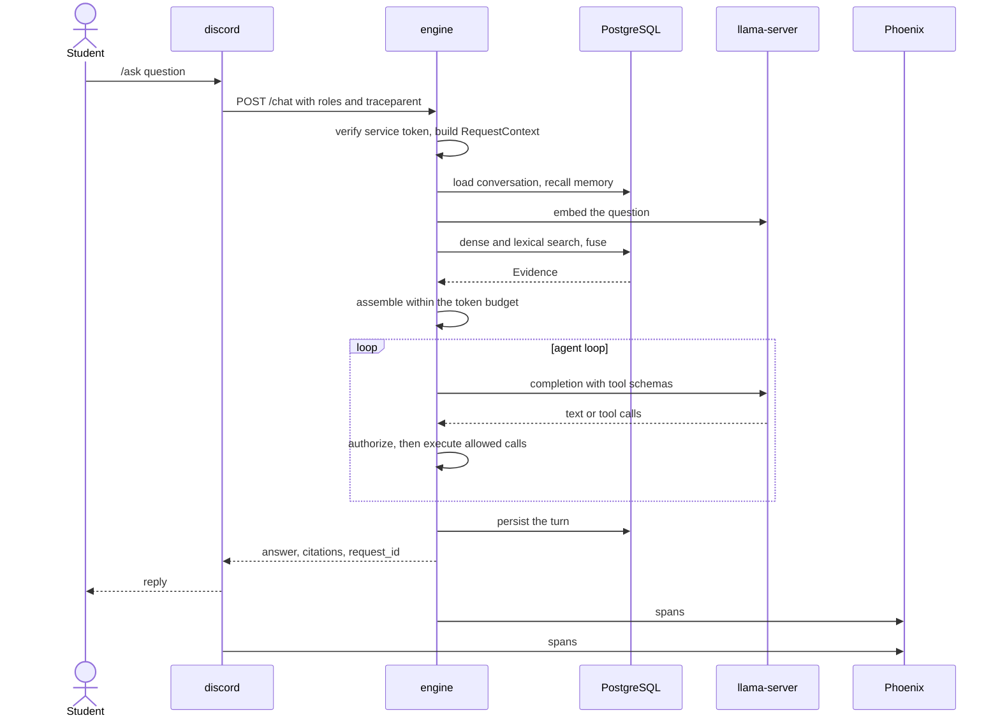
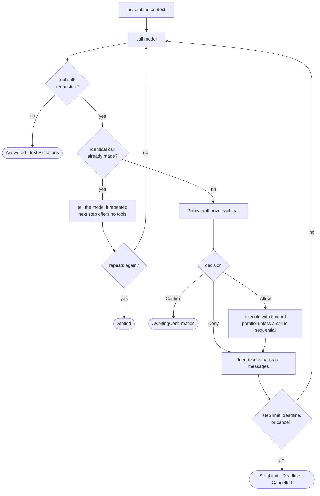
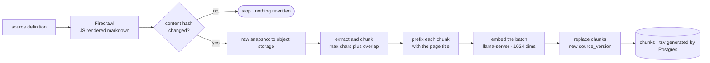
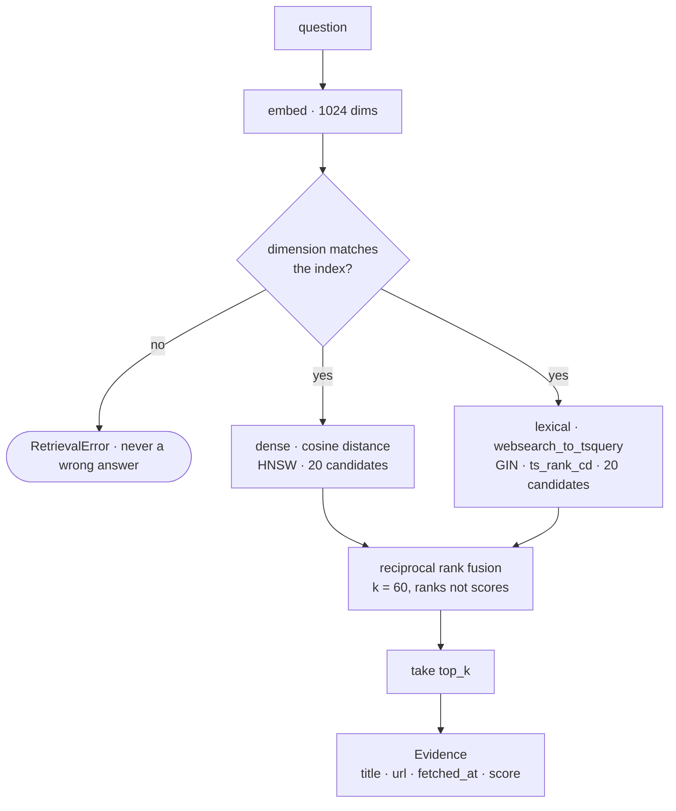
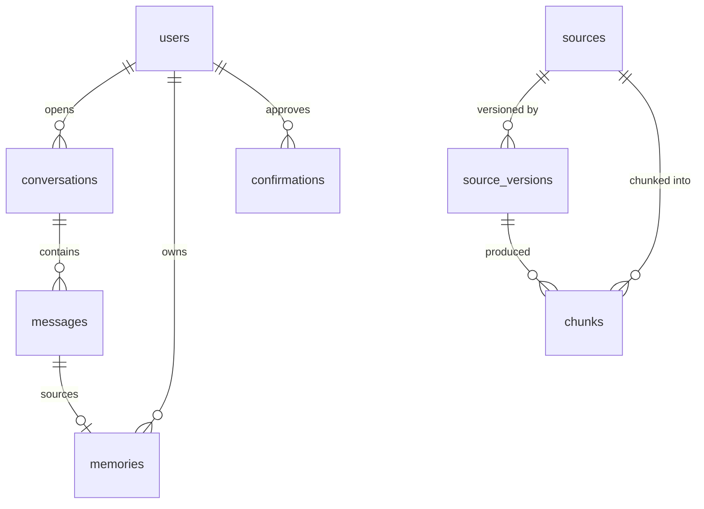
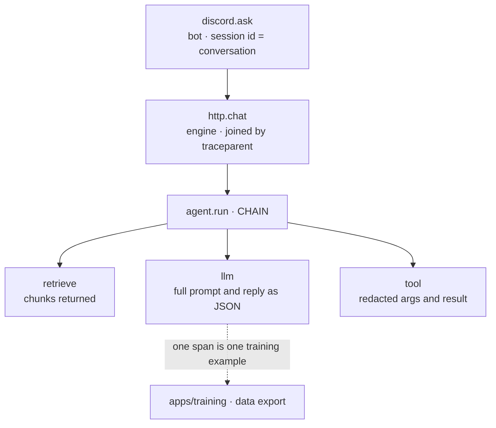
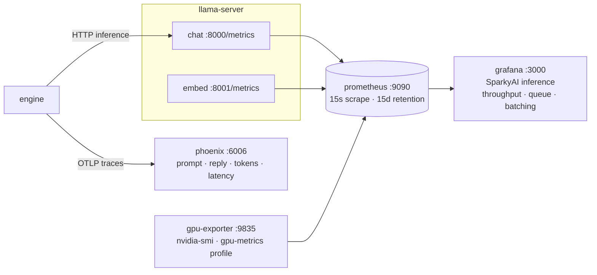

# Architecture

SparkyAI is a Discord copilot for the AI Society at ASU. It answers questions from public ASU sources, keeps conversation and user memory, and performs moderator actions in Discord. Later phases add authenticated browser tasks through the same Playwright MCP server.

This document is the target shape. Order of work is in [ROADMAP.md](ROADMAP.md); decisions are in [decisions/](decisions/).

## Stack

| Layer | Choice | Where |
|---|---|---|
| Engine, Discord bot | tokio, axum, serenity, serde, thiserror, figment | `apps/engine`, `apps/discord` |
| Model and embed clients | Rig (`rig-core`) OpenAI-compatible client. | `apps/engine/src/agent/model/rig_openai.rs` |
| MCP | `rmcp` (official SDK); Playwright MCP | `apps/engine/src/agent/tools/mcp.rs` |
| Scraper | psycopg, boto3, httpx | `apps/scraper` |
| Fetch + extract | Firecrawl, self-hosted; httpx + BeautifulSoup | `deploy/compose.yml` profile `crawl` |
| Browser tools | Playwright MCP over Streamable HTTP | `apps/engine/src/agent/tools/mcp.rs`, compose profile `browser` |
| Web | Vite + React + TypeScript + shadcn | `apps/web` |
| Post-training | Unsloth QLoRA + TRL, TensorBoard, GGUF | `apps/training/posttrain` |
| Evals | Golden cases against `/chat`, deterministic baseline gate | `apps/training/evals` |
| Chat model | Qwen3 GGUF on `llama-server` (OpenAI-compatible HTTP) | `deploy/inference` |
| Embeddings | Qwen3-Embedding-0.6B (1024-dim) on `llama-server` | `deploy/inference` |
| Database | PostgreSQL 17 | `apps/engine` reads, `apps/scraper` writes |
| Vector store | pgvector | same database |
| Cache, queue | Redis 7 | `apps/engine` |
| Object storage | S3-compatible (MinIO locally) | `apps/scraper` |
| Observability | OpenTelemetry → Phoenix; logs under `.sparky/` | every app; `deploy/compose.yml` `phoenix` |
| Config | `SPARKY_<SECTION>__<KEY>` env vars | `config.rs`, `settings.py`, `.env.example` |
| Build, gate | `just` recipes; pre-commit hook and CI | `justfile`, `.githooks`, `.github/workflows` |
| Deploy | Docker Compose (prod pulls GHCR); `llama-server` on a GPU host | `deploy/` |

## Rules

- Open models only, served by `llama-server` behind an OpenAI-compatible HTTP API.
- Facts come from retrieval or live observation, never from model weights.
- Public sites are ingested offline through Firecrawl. The request path never fetches a page as retrieval evidence; browser tools act under `Policy` and never write to the index.
- The engine and the scraper both open database connections; nothing else does. They share the schema in `apps/scraper/migrations`, not code.
- Every request carries its own `RequestContext`. No global mutable state.
- Every replaceable dependency is a trait in `engine/src/core/traits` with a test double in `core/tests/support`.
- The harness owns the loop, policy, context assembly, memory, and tracing. Provider JSON never leaves `agent/model`.
- Model output is never written back as retrieval evidence.
- Anything that creates, changes, submits, posts, books, or deletes requires confirmation immediately before the action.
- Credentials, cookies, and authenticated page content never enter retrieval indexes, memory, or traces.

## Layout

```
apps/
  engine/         Rust bin. The agent, its HTTP surface, and the store adapters.
    src/core/       config · telemetry · types (data: messages, config, errors, wire shapes) · traits (interfaces) · tests. Imports nothing else.
    src/agent/      harness (Agent, ToolSet, RiskPolicy, sinks, assembly) · model (Rig → llama-server chat and embed) · tools
    src/stores/     postgres: Retriever, ConversationStore, MemoryStore
    src/routes/     chat, health
    src/{telemetry,wiring}.rs
  discord/        Rust bin. serenity bot; HTTP client of engine. Never links it. core/{config,telemetry,types,tests}.
  cli/            Rust bin `sparky`. Developer console: runs just recipes and compose services and tails them. core/{config,types,tests}.
  scraper/        Python. Offline ingestion: fetch → snapshot → extract → chunk → embed → index.
    core/{settings,types,tests} · sources · store · migrations/ (the schema)
  training/       Python. datasets from Phoenix llm spans, evals with a baseline gate, SFT → GGUF; evals/cases holds the golden set
  web/            Vite + React frontend and admin UI
deploy/           compose (dev + prod), one Dockerfile per image, inference/ (model serving config)
docs/             ROADMAP.md, this file, decisions/
.sparky/          ignored local state: traces, logs, training data, reports, and outputs
```

Each Python app directory is itself the importable package — `apps/scraper` is `scraper` — with no `src/` layer and no repeated directory name. `pyproject.toml` maps the package to `.` and lists its subpackages, so a new subpackage must be added there.

Every app has a `core/`: config or settings, telemetry, data types, interfaces, and tests. Domain modules import from it; it imports nothing from them.

Everything that runs is under `apps/`. Language is never a folder. ASU domain (library, events, …) is never a folder either — it is a row in `sources` or an entry in a registry.

Services talk only at these edges: `discord → engine`, `engine → PostgreSQL / llama-server / MCP`, `scraper → PostgreSQL / llama-server embed`. The scraper never serves a request; it and the engine meet only in the database.

## System context



Only the scraper touches the web. The engine and the scraper meet only in PostgreSQL. The console starts and stops the other units. The engine serves `/chat` for the bot and an OpenAI-compatible `/v1/chat/completions` for off-the-shelf clients; both run the same loop.

## Inside `engine`



`core` imports nothing else in the crate. `agent::harness`, `agent::model`, `agent::tools`, and `stores` import only `core`; `routes` and `wiring` compose them. Data lives in `core/types`, interfaces in `core/traits`, and stateful objects beside their implementations. `scripts/check-deps.sh` enforces separation between the Rust apps.

## Inside `scraper`

`store/` is the only place it opens a connection. `migrations/` is the schema contract with `engine`: the scraper writes `chunks`, the engine reads them, and `embed.py` must use the model and dimension the engine queries with. Changing the embedding model means re-embedding every chunk.

## Types

```rust
pub struct RequestContext {
    pub request_id: Uuid,
    pub tenant_id: String,
    pub user_id: String,
    pub roles: Vec<String>,
    pub conversation_id: Uuid,
    pub deadline: Instant,
    pub cancel: CancellationToken,
}

pub struct Evidence {
    pub source_id: Uuid,
    pub chunk_id: Uuid,
    pub title: String,
    pub content: String,
    pub url: Option<String>,
    pub fetched_at: DateTime<Utc>,
    pub score: f32,
}
```

Citations are built from `Evidence`, not parsed out of generated text.

## Traits

All in `engine/src/core/traits`, implemented in `agent::harness`, `agent::model`, `agent::tools`, and `stores`. Inputs and outputs are owned Sparky types from `core/types`.

```rust
#[async_trait]
pub trait ModelProvider {
    async fn generate(&self, ctx: &RequestContext, req: ModelRequest) -> Result<ModelResponse, ModelError>;
}

#[async_trait]
pub trait Tool {
    fn definition(&self) -> ToolDefinition;   // name, description, JSON schema, RiskClass
    async fn call(&self, ctx: &RequestContext, args: Value) -> Result<ToolOutput, ToolError>;
}

#[async_trait]
pub trait Retriever {
    async fn retrieve(&self, ctx: &RequestContext, q: &RetrievalQuery) -> Result<Vec<Evidence>, RetrievalError>;
}

#[async_trait]
pub trait ConversationStore {
    async fn ensure(&self, ctx: &RequestContext, channel_id: &str) -> Result<(), StoreError>;
    async fn load(&self, ctx: &RequestContext, limit: usize) -> Result<Vec<Message>, StoreError>;
    async fn append(&self, ctx: &RequestContext, turns: &[Message]) -> Result<(), StoreError>;
}

#[async_trait]
pub trait MemoryStore {
    async fn recall(&self, ctx: &RequestContext, q: &MemoryQuery) -> Result<Vec<Memory>, StoreError>;
    // write and forget arrive with Phase 3, when the agent starts producing memories
}

#[async_trait]
pub trait Embedder {
    async fn embed(&self, texts: &[String]) -> Result<Vec<Vec<f32>>, RetrievalError>;
    fn dim(&self) -> usize;
}

#[async_trait]
pub trait Policy {
    async fn authorize(&self, ctx: &RequestContext, action: &ProposedAction) -> Decision;
    // Decision: Allow | Deny(reason) | Confirm(ConfirmationRequest)
}

pub trait TraceSink {
    fn emit(&self, ctx: &RequestContext, e: TraceEvent);
}
```

## Request lifecycle



1. `discord` receives the slash command and POSTs it to `engine` with the Discord identity, roles, and native permissions. Web, admin, and the `sparky` console hit the same endpoint.
2. `engine` checks the service token, then turns the request and its asserted roles into a `RequestContext`.
3. Load conversation, recall memory, and retrieve evidence from PostgreSQL if the query needs it.
4. Assemble context within a token budget, in fixed order: system instructions (versioned) → role/permissions → memory → evidence → relevant turns → current request, with tool definitions alongside. Tool schemas are charged to the budget first; evidence and history are trimmed to what remains. MCP schemas are compacted and, by default, show only required properties.
5. Run the agent loop below.
6. Persist turn, memory candidates that pass the write policy, and trace.
7. Reply with citations built from `Evidence`.

## Agent loop



The loop owns every stopping condition. Structured output gets one correction attempt. Independent calls run in parallel; a stateful tool makes the step sequential. Identical calls are not run twice.

## Tool risk classes

| Class | Examples | Behavior |
|---|---|---|
| `ReadPublic` | search indexed pages, library hours | run |
| `ReadAuthenticated` | read a page in the user's own browser session | run after session authorization |
| `PrepareWrite` | draft an announcement, fill a form without submitting | run |
| `ExternalWrite` | post, create ticket, book, submit | require Manage Server, then confirm immediately before |
| `Destructive` | delete, cancel | require Manage Server, then confirm immediately before |
| `Forbidden` | another user's session, bypassing policy | deny |

A confirmation is bound to one exact action payload, is single-use and short-lived, states what happens / where / with what data / whether reversible, and is recorded in the trace. If the payload changes, confirm again. External writes are never auto-retried without an idempotency key.

## Knowledge

Ingestion runs offline in `apps/scraper`. Each document records canonical source, fetch time, content hash, parser/chunker/embedding versions, and its previous version on change.



Retrieval happens inside the engine, over the same rows.



Both queries filter by tenant and category. Reciprocal rank fusion combines dense and lexical results without comparing their incompatible raw scores. A reranker is deferred until evals justify it.

## Memory

| Kind | Content |
|---|---|
| Working | current request; not persisted |
| Conversation | turns and tool results |
| Episodic | a useful event from a prior interaction |
| Semantic | a stable inferred fact |
| Profile | approved preferences, interests, goals |
| Task | state to continue a multi-step job |

A candidate is written only if it is useful later, stable, belongs to this user, permitted by its sensitivity class, not a duplicate, and has an expiry. Recall filters by `tenant_id` and `user_id` before ranking; the interface cannot express a cross-user query. Users can view and delete their memory (Phase 4). Conflicting memories keep provenance and timestamps; newer and higher-confidence wins at assembly time, nothing is silently rewritten.

## Storage

| Data | Store |
|---|---|
| users, roles, conversations, messages, memories, source metadata and versions, jobs, confirmations | PostgreSQL (source of truth) |
| chunk embeddings with `source_id`, `version`, `category`, `fetched_at` | pgvector, same PostgreSQL (rebuildable) |
| raw snapshots, model artifacts | object storage |
| browser session secrets | encrypted, separate namespace |
| local traces, console logs, training outputs | `.sparky/` (ignored) |



Each `chunks` row contains a `vector(1024)` embedding and a generated `tsvector`. HNSW, GIN, and tenant/category/fetch-time indexes serve retrieval. Redis is provisioned but unused until multiple engine replicas require shared ephemeral state.

## Background jobs

Discord handlers never block on long work. Ingestion, embedding, browser tasks, reminders, evals, and trace processing run as jobs with id, owner, type, status, input ref, attempts, deadline, cancel state, result ref, and error category.

## Failure behavior

| Failure | Response |
|---|---|
| model unavailable | retry within deadline, then clear error |
| invalid tool call from model | one correction, then stop |
| model repeats an identical tool call | refuse the repeat, next step offers no tools; stop as `Stalled` if it repeats again |
| prompt would exceed the context | tool schemas count against the budget; evidence and history are trimmed first |
| tool timeout | cancel, trace, report |
| retrieval empty | say so; do not guess |
| sources conflict | show both with dates |
| confirmation denied or expired | do nothing |
| write result unclear | do not retry; inspect final state |
| Postgres unavailable | reject stateful requests rather than run without identity or policy |
| trace sink unavailable | continue only with a bounded local fallback |

## Tracing

One trace per request covering every model call, retrieval, memory access, tool call, policy decision, confirmation, and error.



Two forms of it:

- **JSONL** (`.sparky/traces/<request_id>.jsonl`): complete local replay records.
- **Phoenix spans**: cross-process traces joined with W3C `traceparent`. Model spans contain the prompt, reply, model, usage, and invocation parameters used by training export. Retrieval, tool, policy, and scraper spans carry their structured results.

Secrets, credentials, cookies, and sensitive form values are excluded from both forms. The developer console mirrors followed stdout into `.sparky/logs/<unit>.log`; deployments keep stdout with the platform log driver.

## Metrics

`llama-server` runs with `--metrics` and exports Prometheus format on its own port. Prometheus scrapes it; Grafana reads Prometheus. Both are opt-in (`just metrics`) and bind to loopback.



Phoenix holds spans, Prometheus holds time series. A slow request reads as the `llm` span's latency in Phoenix against `llamacpp:requests_deferred` in Grafana for the same minute.

Dashboard panels and the metric names behind them: `deploy/README.md`.

## Authenticated browser tasks (Phase 7)

The Playwright MCP server, never a browser inside the engine process. One isolated browser context per user session; the user completes login and MFA themselves; SparkyAI never asks for or stores a password. Allowlisted domains, blocked or quarantined downloads, size-limited structured observations, redacted action logs, session expiry and cleanup. CAPTCHA, MFA failure, expired session, or an unexpected page stops the task. Authenticated page content is never indexed or memorized. Requires explicit authorization before work begins (see roadmap out-of-scope).

## Deployment

Two images: `sparkyai-rust` (`engine` and `discord`; entrypoint selects) and `sparkyai-scraper`. CD rebuilds only the images whose inputs changed. Datastores run beside them in Compose; `llama-server` runs from `deploy/inference`. Split further only on a measured need: independent scaling, failure isolation, hardware, or a security boundary. Details: `deploy/README.md`.

## Open decisions

Chat model size and quantization · whether a reranker earns its place once the eval set exists · parallel slots per llama-server under load · queue implementation · memory retention periods · moderator access to user conversations and traces · MCP servers in-process vs child process vs remote · app server host.

Record each as a short note under `docs/decisions/` when made.
